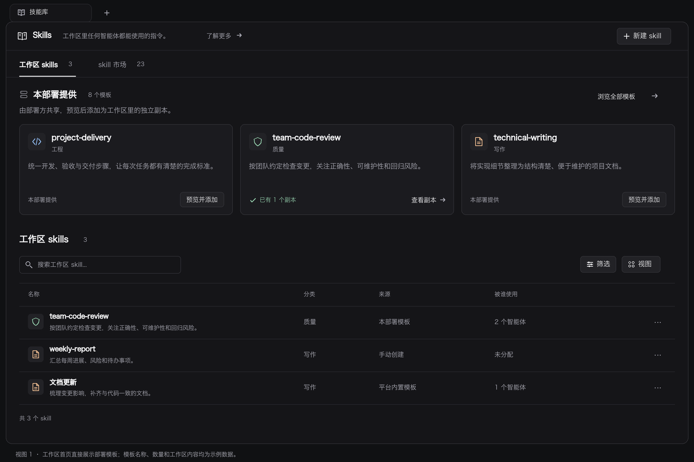
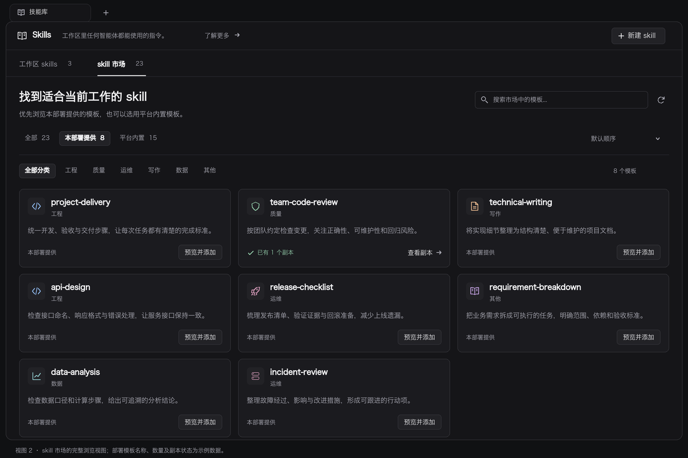
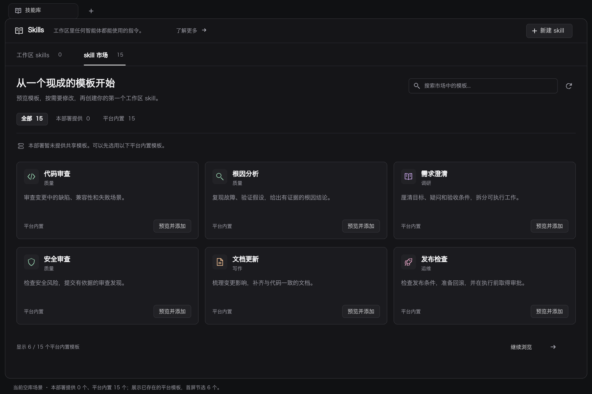

# 技能库中的 skill 市场：展示方案

状态：设计提案，未修改产品代码。

设计目标：用户进入技能库，就能发现部署方提供的模板，理解用途，并从模板创建可编辑的工作区副本。日常管理已创建的 skills 仍然方便。

本方案沿用现有桌面端与 Web 的深色界面、语义色、字体层级和线性图标。数量暂按几十个模板设计。两张有部署模板的效果图使用示例名称与数量，不代表当前真实目录；空库图依据用户截图的“部署 0 / 内置 15”设计。

## 推荐结构

采用“首页直接露出 + 完整市场视图”。

| 方案 | 优点 | 局限 |
| --- | --- | --- |
| 首页展示一排部署模板，同时提供完整市场视图（推荐） | 部署内容进入首屏；浏览和日常管理各有空间 | 需要处理首页与市场的共同卡片和状态 |
| 首页直接展示完整市场，再展示工作区列表 | 所有模板直接可见 | 模板较多时把日常管理挤到页面下方 |
| 只增加“skill 市场”标签页 | 结构简单、占用少 | 已有 skills 的用户仍然可能看不到部署内容 |

技能库顶部保留 `Skills` 标题、说明和“新建 skill”。下方增加 `工作区 skills · 数量` / `skill 市场 · 数量` 两个视图入口。

### 工作区首页

- 页首用“本部署提供 · N 个模板”替代目前只有计数的模板横条，直接露出一排卡片。
- 1440px 内容宽度展示 3 张，首屏预览区控制在约 280px 内；“浏览全部模板”进入市场并选中本部署来源。
- 首排采用稳定的目录顺序，不展示没有数据依据的“热门”“精选”。添加后卡片原位更新副本状态，避免列表跳动；如果模板都已有副本，仍保留真实状态与市场入口。
- 预览区下方是工作区自己的搜索、分类、卡片/列表和批量操作。搜索框明确写“搜索工作区 skill...”。
- 卡片行可以收起为一行标题与计数；收起偏好按工作区记录，展开入口始终可见。
- 本部署没有模板时，首页该区域压缩为一行“本部署暂无共享模板 · 浏览平台模板”，不保留空卡片区域。

### 完整市场

- 市场是技能库页面内的完整视图，搜索和来源选择无需先打开创建弹窗。
- 顶部搜索“市场中的模板”，来源筛选为 `全部 / 本部署提供 / 平台内置`，均显示真实总数。结果区单独显示筛选后的数量。
- 分类采用已有固定分类；只有存在对应模板的分类才显示。数量很少时可省略分类行，保留搜索和来源即可。
- 从首页部署区进入市场时选中“本部署提供”；直接进入市场时恢复本工作区的选择，首次默认“全部”。
- 搜索、来源、分类共同作用于市场结果；来源切换保留关键词，并清理已不可用的分类筛选。
- 有副本的模板仍在市场可见，显示“已有 N 个副本”，点击“查看副本”进入对应工作区 skill；多副本时先列出副本名称供选择。
- 刷新期间保留卡片和选择；仅前台活跃市场订阅适当的刷新，不对隐藏页面重复轮询。

### 当前空工作区

- 确认工作区加载成功且数量为 0 后，首次进入默认展示市场，以“从一个现成的模板开始”引导。加载中或请求失败不能当作空库。
- 本部署模板为 0 时，默认展示“全部”中的 15 个平台模板，保留部署来源计数，补一句“本部署暂未提供共享模板”。
- 手动点进“本部署提供 · 0”时，展示紧凑的局部空状态和“浏览平台模板”按钮；服务器目录路径等部署操作放在帮助说明中。
- 用户主动切换到工作区视图后不抢回市场；创建成功后保持当前浏览位置，用成功提示提供“查看 skill”入口。
- 全部来源都为 0 时，提供“新建 skill”和已有导入入口，不展示示例卡片填充页面。

## 模板卡片与创建流程

每张卡片包含：分类图标、名称、简短用途、分类、来源、动作/副本状态。名称最多两行，描述最多两行；完整文本可在预览中读取。当前部署模板名称来自 ASCII 目录名，样稿使用合法的英文名称与中文用途说明；平台内置模板继续使用已有本地化名称。图中仅使用名称、简介、分类、图标、来源和副本关系，不添加评分、作者、下载量等不存在的数据。

动作统一为“预览并添加”。点击卡片或按钮，直接进入该模板的现有预览，跳过再次选来源与找模板的步骤。

`卡片 → 已选中模板的预览 → 使用此模板 → 按需编辑 → 创建 skill`

首期复用已有创建对话框和模板编辑流程。预览主按钮仍为“使用此模板”，明确下一步进入编辑；最终提交仍为“创建 skill”。后续若希望继续减少跳转，可单独评估把预览和编辑收敛到侧栏，不作为本次展示改造的前置条件。

预览中说明：“将在当前工作区创建独立副本，可以修改；不会自动跟随模板更新。”已有副本不会阻止再次创建，也不称为“已安装”或“已启用”。创建失败保留编辑内容，并在原位置给出重试入口。

## 视觉与适配

- 延续当前深灰画布、稍亮卡片与细边框，采用现有语义 token；图中颜色为这一体系的视觉示意，落地不另建硬编码调色板。
- 页面标题 24px，分区标题 18px，卡片标题 16px，正文 14px，辅助信息 12–13px，复用现有角色字号。
- 分类色只用于小面积图标；使用白色主文字、灰色说明、绿色副本状态，不增加大横幅或无业务作用的插画。
- 根据内容容器宽度切换列数：宽屏 3 列，中等宽度 2 列，窄屏 1 列；卡片最小宽度约 280px，宽屏至多 4 列。
- 同一行卡片高度随最长标题与描述适配。效果图为固定尺寸排版示意，落地不能靠固定高度裁切名称。
- 来源按钮在窄屏允许换行，搜索保持可见。页面采用一个主要纵向滚动区域，不新增目录内部的窄滚动窗口。
- 键盘可打开卡片、切换来源和使用动作；副本链接与预览动作是独立控件，避免嵌套交互。关闭预览后焦点回到触发卡片。
- 主动作不只在 hover 时出现。选中态通过文字和下划线/边框表达；鼠标悬停不覆盖选中态。

## 异常状态

| 情况 | 展示与恢复 |
| --- | --- |
| 初次加载 | 卡片骨架；来源计数待加载，不写成 0 |
| 有缓存，刷新中 | 保持卡片；轻量刷新提示 |
| 请求失败 | 就地错误说明与“重试”；有缓存则继续展示 |
| 搜索无结果 | 显示搜索词与当前来源，提供“清除筛选” |
| 模板在预览时被移除 | 说明模板已不可用；保留已经复制出的编辑草稿 |
| 工作区数据失败 | 市场可浏览；副本状态显示未知，不能把它当作“未添加” |
| 重复点击创建 | 提交中禁用提交按钮；成功后刷新副本关联与工作区计数 |

## 复用与实施边界

现有复用点：

- `packages/views/skills/components/skills-page.tsx`：页面入口、工作区列表及空状态。
- `packages/views/skills/components/skill-template-entry.tsx`：当前计数入口，扩展为紧凑预览区。
- `packages/views/skills/lib/skill-template-discovery.ts`：来源分类、名称/摘要和工作区副本关系。
- `packages/views/skills/components/create-skill-dialog.tsx`：支持用指定 `templateName` 直接进入预览。
- `packages/core/workspace/queries.ts`：复用模板查询及刷新能力。

首期展示方案不需要新后端接口或依赖。市场数据和副本关系继续由 React Query 管理；需要保存的视图偏好归 core 层现有客户端状态模式。共享 UI 位于 views，供 Web 与 Desktop 使用。

剩余限制：API 没有显式模板来源字段，现有 helper 根据内置名称识别来源；落地应先复用该规则，不能依据图中的“本部署提供”新造另一套判断。部署方通过服务器目录提供模板，目前没有页面发布接口，因此本方案不提供“发布到市场”按钮。

验收重点：进入技能库即可看见部署模板；平台/部署计数与筛选一致；可直接预览选中模板；支持已有多个副本；空目录、失败与加载三者可区分；不丢失已编辑草稿；Web/Desktop 和窄窗布局一致可用。

本次只生成设计说明和三张静态效果图。没有改动产品代码，也没有运行产品 lint、typecheck 或测试；静态图已单独检查布局、文字可读性和状态语义。正式实现需补充对应交互验证。
