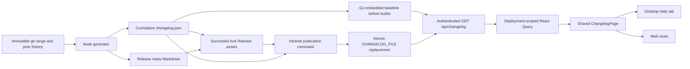

# Desktop changelog technical design

Status: implementation contract, 2026-09-13. Scope: [PRD](./prd.md). Evidence: [official reference](./research/official-reference.md), [desktop integration](./research/desktop-integration.md), and [release pipeline](./research/release-pipeline.md).

## RALPLAN-DR short review

### Principles

1. Release history must represent source and publication truth, including when no fork release exists.
2. The configured deployment owns content delivery; intranet reading must not depend on public services.
3. A single generated artifact connects committed changes, release assets, server builds, and running clients.
4. Preserve established package, navigation, state, and localization boundaries.
5. Prefer small validated files and existing tools over new services or dependencies.

### Decision drivers

1. Existing installed clients must learn about a feed update without a restart, with a measurable bound.
2. This snapshot fork has unrelated imported tags, unpublished work, and concurrent dirty changes.
3. Release history must survive repeated and concurrent release operations without silent loss.

### Viable options

| Option | Strengths | Costs and reasons |
| --- | --- | --- |
| Direct client access to GitHub Releases | Little server work; public releases are easy to inspect | Fails intranet/private deployment, adds per-client public access and authentication, can use the wrong repository. Rejected. |
| Embedded server history only | Offline baseline; deterministic server build | Requires a server redeploy for every new entry. Retained as a fallback, insufficient by itself. |
| Authenticated same-server feed, embedded baseline, hot-read deployment file | Offline first install and live updates; one client contract; no new service | Requires an explicit release-to-intranet artifact handoff. Chosen. |
| Server fetches an external URL plus local fallback, or a database CMS | Supports connected editorial workflows | Adds network credentials, fetch policies, storage, and authorization not required for the requested outcome. Deferred. |

### ADR: deployment-owned release feed

**Decision:** Serve `GET /api/changelog` from the configured backend, using a validated embedded baseline and optional `CHANGELOG_FILE`. Release automation emits cumulative JSON and Markdown before server builds. The successful release publishes those exact artifacts; the intranet publication command validates and atomically installs the JSON for a running server.

**Consequences:** No renderer public network calls, no database migration, no new package dependency, and no change to the binary updater. Runtime file access and Query refresh must be tested together. Operators mount the containing directory, so rename-based publication reaches the server instead of leaving a single-file bind mount on an obsolete inode. Production tags/releases are not created during this implementation task.

## System flow and boundaries



- `server/internal/changelog/`: schema validation, embedded feed, request-time file refresh, last-valid state, and immutable response resource.
- `server/internal/handler/changelog.go`: authenticated HTTP transport and conditional requests. Reuse the existing ETag comparison helper where appropriate.
- `packages/core/changelog/`: typed camelCase model, zod boundary parser, queries, and pure release-selection helpers. No DOM, environment variables, or persisted server-state store.
- `packages/views/changelog/`: shared accessible timeline and state UI. Platform version/navigation are injected or read through existing adapters.
- Desktop/web wrappers own only routing/platform data. `packages/ui` remains business-agnostic.

## Saved artifact schema

UTF-8 JSON, snake_case, one document. Version 1 fields are below; this file contains no deployment runtime metadata.

```json
{
  "schema_version": 1,
  "generated_at": "2026-09-13T00:00:00Z",
  "releases": [
    {
      "id": "fork:example/multica:v9.9.9-test.1",
      "version": "v9.9.9-test.1",
      "title": "Release workflow test fixture",
      "published_at": "2026-09-13T00:00:00Z",
      "status": "prerelease",
      "source": "fork",
      "commit": "1111111111111111111111111111111111111111",
      "base_commit": "0000000000000000000000000000000000000000",
      "sections": [
        {
          "category": "features",
          "items": [
            {
              "text": "An example change for a temporary test repository.",
              "commit": "1111111111111111111111111111111111111111"
            }
          ]
        }
      ]
    }
  ]
}
```

The example is synthetic and must not be added to the seed or shown as a real release.

| Field | Contract |
| --- | --- |
| `schema_version` | Required integer `1`. Unsupported essential schema versions are errors. |
| `generated_at` | Required RFC 3339 timestamp, deterministic for identical generation inputs. Preserve it when an idempotent run changes nothing. |
| `releases` | Required array; a genuinely empty array is valid. No silent truncation. |
| `id` | Required unique string. Published identity is source + repository identity + version; e.g. `upstream:multica-ai/multica:v0.4.37`. Preview identity is stable per fork, e.g. `fork:yangshangwei/multica-0.4.37:unreleased`. |
| `version`, `title` | Required nonempty plain text. A preview may use `Unreleased`; a published version must match the requested immutable tag/version. |
| `published_at` | RFC 3339 string for `published`/`prerelease`; `null` for `unreleased`. Never substitute the current day for an unknown historical date. |
| `status` | Producer values `published`, `unreleased`, `prerelease`. An imported git tag alone cannot set a published status. |
| `source` | Producer values `upstream`, `fork`. No inferred upstream repository links for fork commits. |
| `commit`, `base_commit` | Full immutable commit IDs, nullable only for attributed historical source material without local range evidence. Generated fork entries require both. |
| `sections[].category` | Producer values `features`, `improvements`, `fixes`, `other`. Render localized group labels. |
| `sections[].items[].text` | Required nonempty plain text; neither HTML nor arbitrary Markdown is an executable presentation format. |
| `sections[].items[].commit` | Optional full commit ID retaining generation evidence; product UI need not expose hashes. |

The generator and Go reader validate types, required fields, RFC 3339 values, unique identities, valid status/date combinations, item shapes, and the bounded input size before accepting content. Set a documented maximum file size (2 MiB initially) and reject oversized input rather than dropping older history. Producer inputs reject invalid enums. Client parsing tolerates unknown additive fields and string enum values, renders unknown categories as "Other", unknown source/status with a neutral label, and never promotes them to stable/latest.

A feed belongs to one fork repository. Its `fork:<owner/repo>:<version>` identities must all name the same repository; attributed upstream entries may coexist. Both the generator and Go reader reject mixed-fork histories. Generation additionally requires that repository to equal `--repository`; it never adopts another fork's history or bases. This invariant makes the latest stable fork release unambiguous without adding a second deployment identity field.

## API and file refresh contract

`GET /api/changelog` lives inside the current authenticated API route group. Its content is deployment-wide, independent of workspace membership data; no client-supplied path or URL selects the source. Authentication failures retain existing API behavior.

The JSON response contains all saved artifact fields and these runtime fields:

| Field | Meaning |
| --- | --- |
| `server_version` | The running server build's version, nullable when unavailable. Never copied from the newest release. |
| `feed_source` | `embedded` or `file`, describing the returned content. |
| `is_stale` | `true` when a configured source failed refresh and fallback content is being served. |
| `warning` | Nullable stable public code, initially `changelog_file_unavailable` or `changelog_file_invalid`. No absolute paths, OS errors, or credentials. |

HTTP headers: `Content-Type: application/json`, `X-Content-Type-Options: nosniff`, `Cache-Control: private, no-cache`, and a content-derived strong `ETag`. `If-None-Match` honors weak tags, lists, and `*` via the existing helper. Compute the validator over the complete serialized response, including stale status, so a newly failed file read cannot return a misleading 304 for a previously healthy response. A matching conditional request returns 304 without a JSON body.

Source selection is per service/Handler instance, initialized from `CHANGELOG_FILE` once:

1. No configured file: return the validated embedded feed, `feed_source=embedded`, `is_stale=false`.
2. Configured file: serialize each instance's read/validate/snapshot operation under synchronization, open/read the current path with a size limit, validate the complete document, then replace its last-valid snapshot. Locking only the assignment is insufficient: a delayed old read could otherwise replace a newer snapshot. Return `feed_source=file`, `is_stale=false`.
3. A configured read/validation fails after a prior success: return the last-valid file snapshot with `is_stale=true` and the public warning code. Log the internal error only on the server.
4. A configured file has never been valid: return the embedded baseline with `is_stale=true` and the warning code. Its fallback must not be mislabeled as a successful current file read.

The embedded baseline is validated during load/build tests. The reader does not fetch a runtime external URL, watch arbitrary directories, mutate the source file, or rely on global cache state shared by distinct handlers. Atomic publication means a request sees a complete old or new document; malformed direct edits still degrade safely.

## Client query and presentation

The API client requests unknown JSON, validates with `parseWithFallback`, maps snake_case to camelCase, and returns a typed feed. Use an explicit invalid sentinel; if essential schema validation fails, raise a typed query error rather than replacing successful cached data with an empty "valid" feed. Optional display fields may default safely. No cast of network JSON to a domain type.

Use a query key including `api.getBaseUrl()`, e.g. `['changelog', api.getBaseUrl()]`; the same backend shares content across workspaces, different deployments do not share cached history. Set `staleTime: 0`, `refetchOnMount: 'always'`, `refetchOnWindowFocus: 'always'`, `refetchOnReconnect: 'always'`, and a 60,000 ms interval while the reader is visible and its desktop tab is active. Override global infinite-staleness/focus-disabled defaults. Do not poll in the background; tab reactivation triggers a fresh request even when a kept-alive pane did not remount. Use existing active-tab presentation plumbing, without coupling core queries to the desktop tab store. Retain normal finite cache GC; do not persist releases in Zustand/localStorage.

The page includes a header and manual refresh, installed/server version labels, a chronological release timeline, and a compact month/release navigator. Unreleased work has a separate undated section. Published entries sort newest first with deterministic ties; prereleases have a visible badge; stable "latest" selects the highest valid numeric `vX.Y.Z` among `source=fork && status=published`, independently of publication date. A late publication of an older tag must not regress that label. The official baseline shows its upstream attribution. No stable fork release yields an honest empty stable-release label. Display control labels in all four locales; historical notes remain in their authored language.

Use existing `PageHeader`, `PAGE_GUTTER`, semantic color/typography tokens, Skeleton and CollectionPageState patterns. Avoid a new shell or independent stylesheet system. The shared reader has no raw HTML rendering or docs-specific link rewriting. Controls show refresh activity and preserve content after errors; source-stale warnings and request failures are distinct accessible status messages.

Add `paths.workspace(slug).changelog(...)` and register `changelog` in the existing workspace-page title/icon registry. Mount the view at `/:workspaceSlug/changelog` in desktop and the analogous web route. Hash navigation uses `useNavigation().hash`; the packaged Electron file URL is not the active tab's location. Exact release IDs disambiguate equal upstream/fork versions; the updater's version-only link selects a matching fork entry first and falls back to a readable "entry unavailable" state.

Inject `window.desktopAPI.appInfo.version` from the desktop route wrapper. Read server version from the response/config plumbing. Never use `apps/desktop/package.json` as installed-version evidence. Move/update notification navigation under the existing navigation/workspace providers or inject a safe platform callback; preserve a received event until the relevant shell mounts and keep restart independent from workspace availability.

## Generation and cumulative history

Implement Node standard-library scripts with argv-based git subprocesses. Proposed entry points:

```text
node scripts/generate-changelog.mjs --ref <commit-or-tag> --base <ancestor> --history <prior.json> --repository <owner/repo> --version <version> --status <unreleased|published|prerelease> --output <json> --markdown <md> [--published-at <RFC3339>]
node scripts/publish-changelog.mjs --input <json> --destination <CHANGELOG_FILE>
```

Resolve target/base exactly once to commit IDs and use only those IDs in the range. Reject option-like refs, invalid repository/version metadata, missing/non-ancestor bases, and ambiguous prior published bases. The previous base comes from this fork's published/prerelease history with an ancestral commit, never the highest semver tag or upstream-only entry. With several ancestral releases, choose the unique most recent descendant; require an explicit base if they are incomparable. An explicit base must itself be an ancestor. Include non-merge commits from merged branches; exclude merge messages and routine scoped/unscoped docs/test/chore/build/ci housekeeping by default, retaining meaningful conventional `feat`/`fix`/`perf` and legacy intent subjects.

Read only committed objects. Preview mode can run in a dirty checkout, ignoring all dirty bytes. Release mode requires an immutable tag/commit and clean tracked release inputs before output generation; generated outputs are produced after that check, so their own presence does not invalidate a build. Reject `-dirty` release labels. A preview is never turned into a release by guessing from a package version.

Optional Git trailers provide explicit public wording and categorization:

```text
Release-note: Make newly published updates visible without reopening the app
Changelog: improvements
```

`Changelog: skip` suppresses an entry. Accept the four producer categories; invalid categories, contradictory overrides, or empty overrides fail with the commit ID. Escape Markdown metacharacters when deriving Markdown bullets and never interpolate commit text into a shell command. One generator record supplies both JSON and Markdown; do not call GitHub's independent automatic-notes generator.

`--history` is an explicit required input for generation, including a checked-in seed for the first release. Validate it before doing work and reject fork identities that do not match `--repository`. Preserve published entries and their provenance unchanged; keep stable and prerelease entries together. Preview generation replaces only this fork's preview. Release generation removes its preview covered by the release's commit range, preserving any genuinely later preview work. A same published identity/commit/status rerun retains the existing record and timestamp; a same identity with a different commit/status/content is rejected. A no-change rerun returns the same bytes. Attributed upstream entries cannot overwrite fork entries or vice versa.

The first frozen development preview can use local base `f1c059edee4ec39d464915e9c9a83cf6c0c37925` and inspected target `719cb82d02c1ff80b80e094ba39ffd0f040950a5`. Concurrent commits may subsequently move HEAD; generation and recorded evidence retain the selected immutable IDs. If the seed owner freezes a different inspected target, record that actual ID. Changes predating the local baseline require separately attributed seed evidence, not a claim that `base..target` introduced them. Seed v0.4.37 from the official reference and use `published_at=null` for the fork preview.

For published output, `--published-at` is explicit and stable for that version; CI stores it with generated build metadata and reuses existing published metadata on a rerun. For preview output, `generated_at` can use the immutable target commit time. Do not add the current wall clock on every run. Keep source repository identity and generation inputs in the Markdown metadata/build artifact so subsequent offline generation has an auditable base. Future release tags follow the existing `vX.Y.Z[-suffix]` convention in the fork; never move/reuse an imported upstream tag. Choosing/pushing an actual production version is a later release operation.

## CI and intranet publication

Serialize the entire release workflow under a repository-wide changelog/release concurrency group with `cancel-in-progress: false`, starting before prior-history discovery. A per-tag group does not protect cumulative history. A queued run that GitHub supersedes is not a release; no note publication may claim it completed. Retain existing upstream-only Homebrew and desktop-binary guards.

1. Verify tag, checkout full history, run generator tests and existing release gates.
2. Fetch the newest successfully published cumulative history asset from this repository using the Actions token. Include prereleases, exclude drafts, and resolve its recorded immutable metadata. Querying only `/releases/latest` loses prerelease history. No releases on the first run permits the checked-in seed and explicit local snapshot base; authentication, transient network, malformed JSON, conflicting metadata, or an existing release missing its required asset fail closed. Do not silently fall back to seed after a retrieval error.
3. Generate and validate `changelog.json`, Markdown and immutable build metadata once. Upload them as a workflow artifact. This happens before any backend GoReleaser/Docker build consuming embedded content.
4. Every relevant build downloads that same artifact and places its JSON at `server/internal/changelog/content/changelog.json` before compilation/Docker build. Do not regenerate using a different checkout/date/history inside each job.
5. After verification and both backend/web image manifests succeed, the fork-safe publication job creates/updates the fork Release with `--notes-file` and uploads the exact generated JSON, Markdown and metadata. The fork path must not depend on the skipped upstream-only GoReleaser job or an upstream Homebrew token. Immediately before any remote mutation, re-read published cumulative history and reject built artifacts that omit or change it; a later retry can reuse old successful jobs despite workflow concurrency. Re-run complete preparation/build with a validated explicit first base if no ancestral publication exists, without resetting downloaded history. Use a draft while assembling assets, publish only after upload, preserve prerelease status, and keep GitHub latest on the highest stable numeric version. If an existing published release is being retried, verify its immutable identity before idempotent upload; never overwrite a different release. Required-build failure prevents publication.
6. Include the cumulative JSON and required standalone publisher in the existing `scripts/offline-bundle.sh` and `scripts/build-offline-upgrade.sh` output. Wire `scripts/offline-installer.sh` / `scripts/offline-upgrade.sh` deployment steps to install that feed at the configured mounted path. Local unpublished bundles retain their preview label. The intranet release/deployment step invokes `publish-changelog.mjs`: validate the whole input, create a temp file in the destination directory, flush/close it, and rename it over the destination. Validation or write failure leaves the previous file untouched. No runtime internet access is needed. Verify archive contents and installation with fixtures so packaging cannot omit the feed silently.

Offline target machines currently require Docker and Compose, not a host Node installation. Run the bundled publisher and all its helper modules through the already-loaded frontend image (which contains Node 22), using `docker run --pull never --entrypoint node` and directory mounts for input/output. A missing local image or invalid feed fails before replacing the destination. Fixture tests must prove installation with host Node unavailable and no network pull. Connected/local operator machines may run the same publisher directly with Node.

The same successful artifact is the next offline run's `--history`; connected CI obtains it from the fork Release. Documentation must show the directory mount, `CHANGELOG_FILE`, generator, atomic publication, history handoff, failure/retry behavior, and how to verify the live endpoint. A disconnected deployment must receive the release artifact through its existing transfer/deployment process; the app does not imply it can discover an artifact that has never reached its server.

## Verification and remaining constraints

The [implementation matrix](./implement.md#verification-matrix) maps every acceptance item to evidence. Prove the central path with a temporary git repository, generated cumulative feed, atomic replacement, an unchanged running API process, and an already-mounted page discovering new content. Separately test browser/desktop entry wiring, stale behavior, and CI publication gates. No real tag push, production release, new dependency, or live credential is required for acceptance of this task.

Concurrent dirty paths listed in `research/initial-worktree-status.txt` belong to other work. Narrow additions to shared integration files must preserve them. Do not claim broad checks passed without running them; report unrelated baseline failures separately with evidence.
