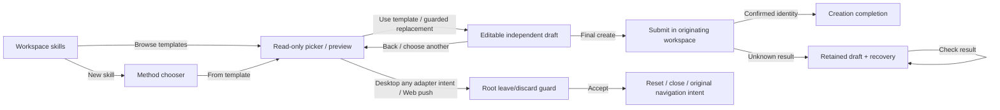

# Skill template entry design

Status: iteration 2 approved by sequential Architect → Critic review; see [review.md](review.md). Planning only. Requirements: [prd.md](prd.md).

## RALPLAN-DR: short mode

Principles: (1) workspace management comes first; (2) one template-to-draft flow owns safeguards; (3) displayed counts/relatedness reflect available evidence; (4) concise display copy never mutates source content; (5) shared keyboard/navigation semantics hold across Web and Desktop.

Top three drivers: reduce the page's competing collections; preserve proven draft/recovery/workspace-affinity behavior; make template and workspace-skill identity understandable without backend work.

| Viable option | Benefits | Costs / tradeoffs |
| --- | --- | --- |
| A — compact entry → existing creation picker (chosen) | Removes the competing catalog, reuses search/preview/draft, keeps one guard owner and one future catalog presentation. | Browsing moves one click away; requires a stable dialog host and guarded navigation snapshots for Desktop tab actions, more lifecycle work than inline links in B. |
| B — retain collapsed inline catalog, shorten rows and show all instances | Templates remain inspectable beside workspace skills; simpler direct links outside a dialog. | Two catalog presentations still drift; expanded rows displace management; source/search/state fixes must be coordinated in both. |
| C — dedicated template tab/route | Strong information separation, deep links and browser history; appropriate for a growing catalog. | Adds navigation/state surface and a handoff into the draft flow; larger platform work than the current need. |

A is preferred because existing picker functionality and safeguards outweigh the extra discovery click. B is a reasonable smaller visual patch but leaves the duplicate browser; C becomes attractive if shareable template URLs or substantial catalog scale become requirements. Neither is rejected as technically impossible.

## Composition and visual contract

Replace only the skills-specific `BuiltinSkillCatalog` with `SkillTemplateEntry` in `skills-page.tsx:1013`; leave `common/builtin-template-catalog.tsx` and other consumers untouched. Keep toolbar behavior, category controls, collection scrolling, and 172 px virtualized cards unchanged. The entry is a restrained semantic-token strip with one browse button, one count line, and optional inline status. The bounded page-shell change below also gives the existing creation dialog a stable lifetime across list errors.

Desktop, 1280×720 (schematic):

```text
Skills 128                                      [新建 skill]
Skill 模板  17 个模板 · 平台内置 15 · 部署提供 2  [浏览模板]
预览模板，再创建独立的工作区 skill。
[搜索工作区 skill...] [筛选] [排序]               [卡片/列表]
分类导航 | 工作区 skill 集合 ...

┌ 模板预览                                  [返回] [关闭] ┐
│ [搜索模板...]  │ 代码审查                               │
│ 平台内置 15    │ 完整用途描述                           │
│ 部署提供 2     │ 工作区已有 2 个相关 skill               │
│ 名称           │ [代码审查] [team-code-review]           │
│ 简短用途摘要   │ 完整只读指令 ...                       │
├ 独立副本说明                         [使用模板]         ┤
└─────────────────────────────────────────────────────────┘
```

Narrow, 375×667 / 360×800:

```text
Skills 128                 [新建 skill]
Skill 模板                 [浏览模板]
17 个模板 · 平台内置 15 · 部署提供 2
预览模板，再创建独立的工作区 skill。
[现有窄屏工具栏，行为不变]
工作区 skill 集合 ...

模板预览 [关闭]       →   模板预览 [关闭]
[搜索模板...]             [返回模板]
[平台内置 15][部署提供 2]  名称 / 完整用途
名称 + 简短用途摘要        工作区已有 ... / 链接
名称 + 简短用途摘要        完整只读指令 ...
[返回] [使用模板]         [返回] [使用模板]
```

Use existing `md` list/preview layout, `min-h-0` scroll regions, semantic colors and role-named typography. Preserve light/dark identity and selected state under hover. Workspace-management search remains hidden below `md` as it is today; the narrow wireframe does not add it. Wrap source-count text and actions; do not hardcode heights that clip translations. Numeric size limits in AC1/AC9 apply to the normal loaded entry, not multi-line error messages.

## Proposed contracts

All additions below are shared views code. Names are planned, not existing exports. Replace the internal `initialTemplateName` prop with one explicit entry value, updating every caller/test; no compatibility shim is needed.

```ts
type SkillCreateEntry =
  | { kind: "methods" }
  | { kind: "templates"; templateName?: string };
interface CreateSkillDialogProps {
  initialEntry?: SkillCreateEntry; // defaults to methods; mount/session seed only
  initialPresentation?: Partial<SkillPresentationMeta>; // existing manual seed
  onClose: () => void;
  onCreated?: (skill: Skill) => void; // creation/recovery semantics only
}
interface SkillTemplateEntryProps {
  workspaceId: string;
  onBrowse: () => void;
}
interface RelatedSkillNavigationRequest {
  readonly sourceWorkspaceId: string;
  readonly sourceWorkspaceSlug: string;
  readonly skillId: string;
  readonly path: string;
  readonly title: string;
  readonly intent: LinkClickIntent; // push | background-tab | foreground-tab
}
interface TemplateSkillCreatePanelProps {
  workspaceId: string;
  workspaceSlug: string;
  session: TemplateSkillSession;
  onUseTemplate: (template: SkillTemplate, names: readonly string[], description: string) => void;
  onBack: () => void;
  onOpenCandidate: (candidate: SkillCreationCandidate) => void; // recovery only
  onRequestOpenSkill: (request: RelatedSkillNavigationRequest) => void;
}

// skills/lib/skill-template-discovery.ts: pure derivations, no queries or state.
interface SkillTemplateDiscoveryItem {
  template: SkillTemplate; // original object, never shortened or rewritten
  presentation: SkillPresentation;
  summary: string; // display only
  source: "builtin" | "deployment";
}
declare function getSkillTemplateDiscoveryItems(
  templates: readonly SkillTemplate[], t: TFunction<"skills">
): SkillTemplateDiscoveryItem[];
declare function getRelatedWorkspaceSkills(
  templateName: string, skills: readonly SkillSummary[],
  presentSkill: (skill: SkillSummary) => SkillPresentation
): SkillSummary[];
// skills/lib/skill-presentation.ts: template-only summary resolver.
declare function getBuiltinRoleSkillSummary(
  name: string, t: TFunction<"skills">, storedDescription?: string
): string | null;
```

`getSkillTemplateDiscoveryItems` ignores unnamed records, preserves catalog order, uses existing built-in presentation or supplied fallback, and classifies solely by `presentation.isBuiltin`. Summary uses a new `builtin_role_skills.<canonical>.summary` field only for recognized uncustomized defaults; otherwise use the full supplied/presented description with visual line clamping. Share the existing exact-default recognition rule if a small extraction is needed; never invent prefix/version heuristics or another manually maintained name registry. Existing `SkillPresentation`, `description`, `searchText`, `searchNames`, draft builders, and other consumers keep their contracts (`skill-presentation.ts:36,89`).

Relatedness is a pure `filter`, not `find`: match canonical name plus `presentSkill(skill).isBuiltin`, OR an object `template_source` whose string `name` equals the template name. A record matching both appears once. Preserve query order; show every result and each presented name, using canonical name as a secondary disambiguator when useful. Do not compare versions, grant rights, or treat metadata as content equivalence. No zero label until the workspace query has successful data.

## Query, selection, and phase behavior

Both entry and picker reuse `skillTemplateListOptions(workspaceId)`; picker retains `skillListOptions(workspaceId)`. React Query owns fetched data; counts/grouping/relatedness are derived. Local search/source/narrow-preview state stays ephemeral. No new store or server contract.

`SkillsPage` currently mounts `CreateSkillDialog` at different React positions in its `listError` and normal returns (`skills-page.tsx:938,965,1187`). Replace that duplication with one unconditional outer return: conditional page body as one child, and one `{creation && <CreateSkillDialog ... />}` sibling outside that body. A same-workspace error/retry changes only the body, never the dialog's position/key. Keying the dialog by workspace ID is permitted to make workspace reset explicit; never key it by query status, source selection, or count. Keep creation state in `SkillsPage` and session/guard state in the existing dialog—no store or generic shell abstraction.

The new `skills-page-template-session.test.tsx` uses real `SkillsPage`, QueryClient and creation dialog to prove edited draft, unconfirmed submission, and pending discard survive cached skill-list failure and successful retry. Standalone panel/dialog tests cannot prove this ancestor lifetime. Workspace changes remain a separate reset case.

| State | Entry / picker behavior |
| --- | --- |
| Cold catalog, no data | Entry remains discoverable, count is loading rather than zero; browse opens loading status. Adoption unavailable until there is a valid selected template. |
| No-data catalog error | Explicit failure and retry; no empty-state/count claim. Retry stays in this dialog. |
| Cached catalog while fetching, including refetch error | Keep cached counts, rows and preview usable; show one muted refreshing or failed-refresh status with retry. Do not blank content or discard a draft because `isError` is true. |
| Successful empty catalog | `暂无可用模板`; no adopt action; retain back/close. Distinct from failure; optional refresh does not imply a failed request. |
| Search with no results | `没有匹配的模板`; clear search affordance; source counts reflect filtered groups; no adoptable hidden selection. |
| Deployment-only / empty source group | Initial active source is first nonempty group (builtin first when present); source tabs remain available with truthful counts and existing deployment hints. A tab with no templates says so; a filtered populated group says no matches. |
| Workspace query pending/error without data | Preview/source remain usable; related section says loading or unable to load, with retry. Never infer zero from `data ?? []`. Existing server name-conflict handling remains authoritative. |
| Workspace query has cached data and refresh fails | Show known related links/count plus a small stale/error hint; retain navigation and draft. |
| Parent skill-list query fails/retries in the same workspace | Conditional error/normal page body may change; the same dialog stays mounted with edited draft, unconfirmed submission, pending discard, and snapshotted navigation intact. |
| Workspace changes | Existing session reset/abort/generation checks remain authoritative; reset picker ephemeral state and root pending navigation/discard. New query keys use the new workspace; never reuse old related links. |

Fresh browsing opens without a seeded name. After data loads, derive active source from a valid explicit seed or the first nonempty source, then preview the selected visible row or the first visible row in that source. Search and source switching may change displayed preview but never adopt a template. A missing named seed falls back to browsing. A selected preview must always belong to the currently visible source/results; no deployment preview behind a selected platform tab. Narrow screens initially show the list.

Keep the full template purpose above full read-only instructions; only picker rows use summaries. `使用模板` passes the original template, existing names, and the full `presentation.description` to the existing root handler. Same-template adoption resumes the existing draft; adopting another uses the existing discard guard. The header becomes `创建副本` only in editor state. Returning through picker/chooser retains draft and unconfirmed-submission state (`create-skill-dialog.tsx:680,703,756`; `use-template-skill-session.ts:89`).



## Existing-skill navigation and focus

Desktop mounts exactly one active tab; switching tabs unmounts its dialog (`apps/desktop/src/renderer/src/components/tab-content.tsx:18,60`). Even background/middle opens can activate an already-open destination (`apps/desktop/src/renderer/src/stores/tab-store.ts:571-586`). Therefore every Desktop related-link adapter action must use the existing root busy/dirty/unconfirmed guard; no tab intent is assumed to retain the dialog.

Render real `AppLink` anchors with workspace paths and presented `newTabTitle`, preserving shared link/classification behavior (`navigation/app-link.tsx:45`, `click-intent.ts:18`). On Desktop, intercept primary click/Enter and middle `onAuxClick` before AppLink navigates, synchronously prevent default, resolve intent with the shared helper, and snapshot the complete `RelatedSkillNavigationRequest` at that original gesture. Source UUID and route slug come from `useWorkspaceId()` / `useRequiredWorkspaceSlug()`; path, skill ID and presented title come from that rendered related link. Do not read the confirmation button's modifier keys or recompute title/path after locale, selection, or query changes. On Web, intercept only AppLink's in-place push case; leave its native modified-link cases untouched.

| Activation | Required outcome |
| --- | --- |
| Desktop push, including Enter / Shift alone | Guard first; acceptance resets/closes then calls `navigation.push(request.path)` exactly once. |
| Desktop background intent, including middle click | Guard first, even when the destination might already be open; acceptance resets/closes then calls `openInNewTab(request.path, request.title)` exactly once. Retain adapter dedup/activation semantics. |
| Desktop foreground-tab intent | Guard first; acceptance resets/closes then calls `openInNewTab(request.path, request.title, { activate: true })` exactly once. |
| Web in-place push | Same root guard; acceptance resets/closes then pushes the snapshotted path exactly once. |
| Web-native Cmd/Ctrl(+Shift), middle, or Shift-alone handling | AppLink/browser owns navigation; leave the current dialog/draft and native default behavior intact. |

The root records the request in its existing pending-action flow. Busy requests perform no navigation; Cancel clears the pending action and restores the originating link's focus. Before immediate or confirmed execution, compare the snapshot's source UUID and slug with current workspace refs; mismatch cancels it. Clear pending actions on close/workspace reset. On acceptance, consume the request once, reset the session, call `onClose`, then execute the original intent; never call `openCandidate`, `onCreated`, or a creation-success toast. If the required tab adapter is unavailable, cancel rather than silently converting the saved intent into a push. Keep recovery `onOpenCandidate` separate and unchanged.

Related links stay within the existing preview scroll region; zero is text, one is a named link, many is a count followed by all links. Never silently choose a preferred instance. AppLink's existing suite owns the full gesture-classification matrix; root-flow tests own snapshot/guard/adapter integration, including activation of an already-open background destination.

Opening the dialog focuses search. Row activation on narrow screens focuses an appropriate preview heading/action; Back restores that row, or search if it vanished. Draft adoption focuses its name input. Closing returns focus to its entry trigger. Cancelling discard restores the originating link/control; source controls use existing tab keyboard behavior. Use real primitives in tests, `role=status` for loading and unobtrusive updates, `role=alert` for failures, visible focus, and meaningful link names. All four locales must fit, with no full recovery-matrix duplication per locale.

## ADR-001

Decision: use a compact skill-only discovery entry and enrich the existing picker with display summaries and complete related-instance links.
Drivers: management priority, one guarded creation flow, truthful identity/counts.
Alternatives considered: improve retained inline catalog (B); dedicate a template route/tab (C), as evaluated above.
Why chosen: A removes duplicate presentation while preserving root ownership of session state and the established request boundary.
Consequences: one extra discovery click and two bounded lifecycle changes: a single stable page-level dialog host, and immutable requests through the root guard for every Desktop tab intent. B keeps instance links outside creation state and avoids the second coupling; it is smaller in that respect, while retaining duplicate catalog presentation and expanded-page displacement. A accepts these costs to retain one future browser and session owner. No tab-store/adapter redesign or backend migration is needed. Cached data may be stale and is labelled accordingly; relation metadata remains informational.
Follow-ups: independently measure card density/accessibility and source-facet taxonomy; revisit a route only for explicit deep-link/catalog-scale needs. Sequential Architect and Critic re-review approved these bounded changes; see [review.md](review.md).

## Review adoption: iteration 2

Both reviewers accepted direction A and requested iteration. Incorporated: guard every Desktop adapter intent because tabs can unmount the source; snapshot original workspace/path/title/intent; stabilize the dialog across same-workspace query transitions and add its integration suite; run all three E2E specs in the isolated alternative; preserve the existing narrow management toolbar. Re-review is approved; implementation evidence remains pending. This artifact authorizes no product implementation, push, or task activation; disposition of the planning documents is owned by the parent workflow.
