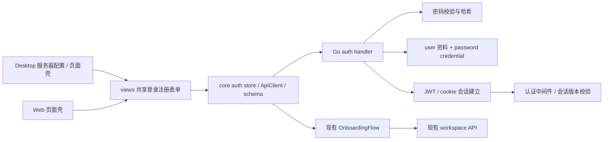

# 架构设计

> 实施更新（2026-10-01）：用户已批准并启动开发。下文保留评审时的设计说明；当前完成项与未测边界以 [verification.md](verification.md) 为准。

## 模块边界

- `apps/desktop/src/main/`：服务器配置持久化、跨窗口切换、daemon 旧连接释放。
- `apps/desktop/src/renderer/src/pages/login.tsx`：桌面壳和导航；绑定是 WindowOverlay。
- `packages/views/`：可复用表单，不导入 next/router 或直接定义 Zustand store。
- `packages/core/auth/`：注册/登录/绑定动作和用户会话；server 数据继续由 React Query 管理。
- `packages/core/api/`：协议、schema、authEpoch/credentialEpoch，成功登录推进代际，旧 401 不可清除新会话。
- `server/internal/handler/`：策略、校验、事务和响应；`server/internal/auth/`：哈希、认证版本规则；`server/pkg/db/queries/`：明确查询。
- `packages/ui/` 只提供原子控件；core 不直接使用 localStorage/process.env。

## 数据模型（拟新增）

保留 `user.id UUID`、`user.name`、原 onboarded_at 等资料。将 `user.email` 从 NOT NULL 改为可空；已有邮箱及设备虚拟邮箱不删除。新密码用户 email=NULL，不构造伪邮箱。

新增 `user_password_credential`：

| 字段 | 说明 |
|---|---|
| user_id UUID NOT NULL | 对应现有 user；唯一，应用层维护关系，不加外键 |
| username TEXT NOT NULL | 规范化后登录名；唯一 |
| password_hash TEXT NOT NULL | 算法、工作因子、盐、派生值的版本化编码 |
| session_version BIGINT NOT NULL | 初始 1；设置/重置密码递增 |
| must_change_password BOOLEAN NOT NULL DEFAULT false | 运维恢复临时密码必须更改后才能使用业务 API |
| created_at / updated_at | 记录凭据生命周期 |

两条唯一索引分别放入两个单语句 `CREATE UNIQUE INDEX CONCURRENTLY` migration。不要通过表内 PRIMARY KEY/UNIQUE 隐式创建违反本仓库规则的索引。部署顺序为放宽 email → 创建凭据表 → user_id 唯一索引 → username 唯一索引；索引全部有效后才启用写入。失败或 invalid index 必须修复，不只依赖 schema_migrations 已记录。

sqlc 重新生成后处理 email 可空波及的所有用户查询。handler 显式把 nullable email 投影为 API 字符串，避免更改已安装客户端的字段类型。审计成员展示、邀请、个人设置、analytics、CLI/daemon 对邮箱非空的假设。不能把 password_hash 放到通用 SELECT * 的 user 上。

## 密码存储

采用 Go 1.26 标准库 `crypto/pbkdf2` + HMAC-SHA256，初稿 600,000 次、至少 16 字节 crypto/rand 盐、32 字节派生值；使用 crypto/subtle 常量时间比较。参数与编码带版本，以便未来升级。上线前在目标 CPU 做延迟和并发基准，不随意下调工作因子以掩盖资源问题。

解析存储哈希时对长度、版本和迭代范围做上界校验；不支持或损坏的哈希拒绝登录。不存在的账号执行同量级的 dummy 校验，限制时间差枚举。密码请求体有尺寸上限，先校验长度和限流再运行 KDF。无新模块依赖；若改用 Argon2id，必须另行记录新增依赖授权与基准。

所有 KDF 入口（注册、登录、绑定、改密码和 dummy 校验）共用进程级有界并发门禁。初稿上限 min(4, GOMAXPROCS) 且至少1，不排无界等待队列；容量用尽立即返回503及 Retry-After，取消的请求不得继续占用等待队列。工作因子与并发上限在目标硬件一起基准，配置必须为有界正整数。

## 会话与身份边界

复用 issueJWT，但增加 `auth_version` claim。存在密码凭据的用户，每个 JWT 认证都必须校验数据库当前 session_version；缺失 claim 视为旧版本 0，不能访问已绑定版本 1 的账号。校验存储不可用时 fail closed，返回可恢复的服务错误，不能退回仅验签。

第一版直接查询数据库版本，password 模式绕过 PAT/daemon 授权缓存；个人派生凭据也保存签发版本。签发和重置共享用户行锁，事务内重验授权来源版本，避免在途旧请求获得新权限。具体数据列及撤销范围见 security-contract.md 第 2 节。

password 模式中未绑定历史用户只能在受控迁移期限内使用合法 JWT 访问 `/api/me`、绑定及必要退出入口；普通业务 API、token mint/renew 及 WebSocket 升级必须拒绝。`/api/me` 返回 requires_account_setup，客户端先进入绑定，不预热 workspace/启动 daemon。

绑定不是“任何 human actor 都可以”：只接受用户 JWT/cookie，不接受 mul_ PAT、mat_ task token、mcn_ cloud PAT 或其他机器凭据。请求中 user_id 不可决定目标；目标唯一来自验证后的会话。

绑定、修改密码和运维恢复使旧 JWT、PAT、该用户签发的 task/daemon token 及 member actor 插件回调失效。保留独立 plugin actor 身份，不因 installed_by 改密删除插件。password 模式拒绝 Cloud Fleet 凭据。普通 realtime 和 daemon WS 都在发送受保护事件前验证权限并尽力关闭旧连接，不能只等待客户端发消息。保留业务历史和 membership，不调用完整成员移除流程。精确撤销边界与在途操作语义见 security-contract.md 第 2–3 节。

## 可靠限流

现有 RateLimit 在无 Redis/Redis 故障时放行，不能直接满足密码场景。新增密码专用 limiter：按规范化用户名及来源 IP 两维，未知用户名同样计数；IP 阈值宽于单账号阈值，避免公司 NAT 误伤全部员工。不要永久锁账号。

采用固定窗口原子计数所有准入尝试，成功不清零。首版账号/IP 阈值、50,000 桶容量、single/shared 配置及故障语义见 security-contract.md 第 4 节；默认值仍需目标 CPU 和公司 NAT 测试。共享 limiter 故障返回 503，不静默放行；仅信任明确代理网段的转发链。

## 服务器切换

当前全局 multica_token 会被 core provider 注入新 API。目标第一版采用“切换即退出旧服务器”而非多服务器会话管理：校验目标地址 → 停止旧 WS/释放旧 daemon 连接 → 取消旧请求、推进代际 → 清认证、Query cache、workspace mirror 与服务器关联视图缓存 → 保存新地址 → 所有窗口同步重载 → 使用无凭据 API 探测新服务器。

主进程串行协调、关闭副窗，清理完成后才保存 B；本地清理失败不激活 B，保存失败保持已退出。HttpOnly 与同主机跨端口 cookie 由主进程处理，Desktop bearer 请求 omit cookie，Web 保留 cookie 模式。探测不携带认证/空间/CSRF 头；成功响应与失败响应均校验服务器代际。完整状态机见 security-contract.md 第 5 节，不增加多服务器账号记忆。

## 资料与可观察性

对外 user 增加可选 username；name 仍是主展示。日志记录操作结果、user_id、request_id、限流状态，不记录密码/哈希/完整 token 或请求体；不向第三方 analytics 上报表单内容。没有邮箱时不发送邮件，不将空字符串作为可邀请身份。

## 评审后的数据补充

除 user_password_credential 外，PAT、task_token 增加 auth_version，daemon_token 增加签发 user_id/auth_version，member CallbackGrant 保存版本。旧数据默认版本 0，旧 daemon 签发人允许 NULL；password 模式拒绝无确定身份/版本的个人凭据。迁移不构造推测 owner，不新增外键。以 security-contract.md 第 2 节为实施契约。
