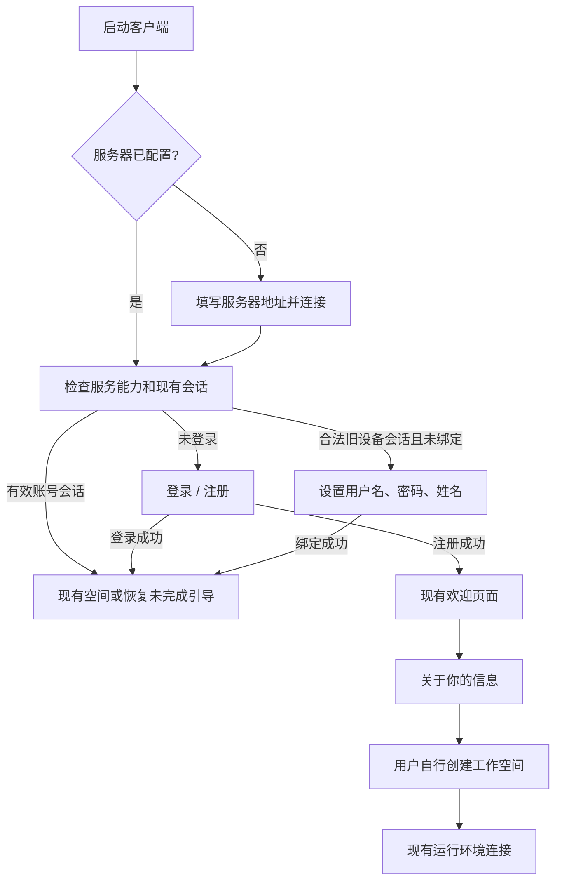

# 交互设计

## 页面路径

## 连接服务器

复用 endpoint-setup.tsx 和 runtime config IPC；本任务不新增服务器选择系统。成功连接后在登录界面显示目标地址和“更换服务器”。探测请求不得带之前的认证令牌。

状态：未填写、连接中、可连接、地址不合法、网络不可达、证书不受信、协议不兼容。错误不自动跳过，不自动降级为设备登录。正式部署使用受信 HTTPS；本地开发例外单独配置，不静默接受无效证书。

## 注册 / 登录

默认展示登录入口，并提供显眼的“创建账号”；注册页面只有用户名、姓名、密码三个字段。无需邀请字段和激活按钮。

- 注册按钮：“注册并开始使用”。成功才进入欢迎引导。
- 登录页面：用户名、密码、“登录”。不显示姓名输入框。
- 姓名提示：“用于成员列表、任务和评论展示，可填写真实姓名。”
- 用户名提示：“用于登录，支持字母、数字和下划线。”
- 用户名冲突：“这个用户名已被使用，请换一个。”
- 登录失败：“用户名或密码错误。”
- 限流：“尝试次数过多，请稍后再试。”结合 Retry-After 显示等待时间。
- 注册响应丢失：“暂时无法确认注册结果。请重试，或使用刚设置的账号登录。”
- 忘记密码：“请联系部署维护人员重置密码。”不提供不能工作的邮件链接。

支持键盘操作、关联 label、错误描述、密码管理器 autocomplete（username / name / new-password / current-password）。密码支持粘贴、显示/隐藏；提交时禁用重复提交并显示进度。密码只存在表单内存，不写持久化草稿、URL、埋点；离开页面或成功后清空。

## 欢迎引导复用

复用 OnboardingFlow → StepWelcome → StepAboutYou → StepWorkspace → StepRuntimeConnect。工作空间创建仍使用现有名称、slug、issue prefix 校验，不把前面的“起个名”简化成删除既有字段或改变规则。

注册的姓名是账号展示名；about-you 中的问卷继续保持原语义，不因为标题类似而重复要求填写账号姓名。已有空间的老用户按原有恢复/选择规则进入；未完成引导从可恢复节点继续。

## 旧设备账号完善

界面标题：“设置登录账号”。解释：“设置后可以在其他电脑登录，你的工作空间和历史数据会保留。”三个字段与注册相同，姓名预填原展示名但允许修改。提交使用绑定接口，不调用新用户注册接口。

若凭据已失效：提示联系部署维护人员恢复原账号，也允许明确返回新账号注册；不能自动另建账号并声称数据已经迁移。

## 最小页面变动

桌面登录页保留服务器信息、DragStrip 和平台行为；注册表单及校验反馈放共享 views。绑定使用现有 WindowOverlay 扩展，不能新增桌面预空间路由。Web 使用应用层路由接同一共享表单。

## 评审补充：恢复和服务器切换

临时密码登录后显示“设置新密码”，只允许完成修改或退出；修改成功后再进入工作区/运行环境初始化。绑定或改密可能中断当前账号运行环境上的执行，提交前提示，历史记录保留；不要承诺自动重放任务。

切换服务器的清理/保存期间禁用重复操作；保存失败提示已退出原账号，可重试或回原服务器重新登录。保存成功但重载失败显示重试重载入口，不能继续显示旧账号业务页。新客户端遇到矛盾的认证能力配置应提示服务器配置异常，不尝试设备登录。
