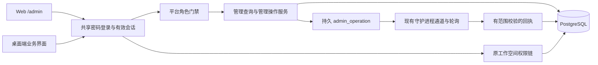

# 平台管理后台：架构设计

状态：设计提案；本文件中的新表、服务和路由尚未实现。需求基线为 [prd.md](prd.md)，首期为自托管密码模式、100–1000 台受管理安装实例。

## 1. 架构决定

- 复用 Go API、PostgreSQL、Next.js Web 和现有 Query/鉴权设施；不拆新服务、不新增依赖、不新建管理员密码库。
- `user` 与 `user_password_credential` 继续表示同一个人的身份与凭据；`platform_role_binding` 表示独立的平台授权。工作空间 `member.role` 不授予平台权限，平台角色也不自动授予工作空间成员资格。
- 管理界面仅挂载于 Web `/admin`；保留 `/login?next=/admin` 的现有登录入口。`admin` 已在保留 slug 中，不需要增加同义根路径。
- `/api/admin/*` 放在现有 `middleware.Auth` 内、工作空间中间件外，额外使用严格的登录会话与平台角色门禁。任何管理查询都不得以删除旧 API 的成员校验来实现。
- 首期维护一个内部 `organization`；`organization_workspace` 将多个工作空间归属到该组织。组织是客户边界，工作空间是协作边界。

## 2. 层次与职责

| 层 | 职责 | 禁止事项 |
| --- | --- | --- |
| Web 平台层 | `/admin` 路由、登录跳转、独立布局、清除当前工作空间镜像 | 复用要求 workspace 的 `DashboardGuard`；向桌面注册后台路由 |
| `packages/views/admin/` | 后台页面、表格、详情、状态和拒绝界面 | 导入 `next/*`；保存服务端对象到 Zustand |
| `packages/core/admin/` | API schema、Query keys、查询和 mutation | 信任 UI 角色；使用 `process.env` 或直接 `localStorage` |
| Go handler | 参数解析、状态码、平台门禁、分页响应 | 直接拿普通 workspace handler 绕过鉴权 |
| Go service | 账号/角色事务、操作幂等、审计、组织归属 | 在提交前广播；自动补齐丢失权限 |
| SQL/sqlc | 明确列投影、稳定游标、事务查询、汇总 | 从通用业务 DTO 意外泄露私有正文 |

后台查询统一使用 detailed-design.md 的 `['admin', apiScope, userId, organizationScope, resource, filters]` 独立缓存键；工作空间作用域筛选作为过滤参数加入键。退出、账号切换、403 撤权时清除后台缓存。授权和后台响应不做持久化，不进入公共缓存；响应带 `Cache-Control: no-store`。前端角色缓存只决定菜单渲染，服务端每次重新授权。

## 3. 数据边界

以下均为拟新增实体；字段与索引清单以详细设计及迁移方案为准。

| 实体 | 负责的数据与关系 |
| --- | --- |
| `organization` | 首期唯一内部组织、状态；未来客户组织 |
| `organization_workspace` | 每个工作空间唯一有效组织归属，创建者与关联时间；关系由应用校验 |
| `platform_role_binding` | 用户 UUID、单一平台角色、授予人、时间；用户唯一绑定，角色为 `super_admin` 或 `platform_observer` |
| `managed_installation` | 安装实例、负责人、组织、能力版本、健康快照；不是物理硬件身份 |
| `installation_daemon_binding` | 安装实例与 daemon 的受验证关联及生命周期；不以名字/IP 建立信任 |
| `admin_operation` | 有效操作请求、幂等键、目标、期限、送达与终态；不存密码 |
| `admin_audit_event` | 不可被普通管理 API 修改的具名操作记录、范围、变化摘要、结果 |
| `admin_alert` | 告警聚合键、状态、负责人、处置与恢复证据 |

`user` 增加持久禁用状态，复用 `user_password_credential.session_version` 作密码模式撤销版本；不创建第二个互不一致的管理员版本号。角色是否有效始终读取当前 binding 和账号状态，不写入长期 JWT 作为权限依据。

旧工作空间分批回填内部组织；新建工作空间与归属写入同一事务。切换后台启用开关前必须验证无漏项。旧终端归属不能推断时保留未关联状态。未来组织管理员查询必须先从授权获得组织集合，再与请求筛选求交，客户端传入的 `organization_id` 不能扩大范围。

## 4. 核心请求路径

1. 管理员使用普通密码登录，得到与桌面相同体系的 JWT/cookie；未完成设置或强制改密只能进入现有受限流程。
2. `/api/admin/me` 验证会话类型、版本、账号状态，再从数据库读取角色；没有工作空间不影响进入后台。
3. 读请求只投影允许的平台元数据。私有任务标题、正文、聊天消息、日志、附件、路径和产物需要原资源权限；平台权限本身不足。
4. 写请求先校验操作者；在事务中按统一顺序锁定并重验权限、版本与目标状态。原子提交业务变更、操作记录与审计。
5. 提交后通知终端或断开被撤销用户的连接。通知失败不回滚已提交事实；持久操作和终端轮询支持核对。

角色撤销提交后的新请求必须拒绝。已进入写事务的操作与撤权共享行锁：先提交的事务定义先后次序，不能让先校验后排队的旧角色写请求在撤权之后继续提交。读请求以其授权查询时刻为准，不承诺撤回已发送字节。

终端接入、停止接单和取消执行的协议由 [terminal-execution-design.md](terminal-execution-design.md) 定义；平台管理员可执行已授权的运维动作而不获得目标任务内容权限。

## 5. 计划中的文件落点

| 位置 | 拟变更 |
| --- | --- |
| `server/cmd/server/router.go`、`handler/handler.go` | 注册管理 API、注入服务、密码模式与功能开关 |
| `server/internal/handler/admin_auth.go`、`admin_user.go`、`admin_query.go`（新增） | 会话/角色白名单、账号操作、只读查询与白名单 DTO |
| `server/internal/service/platform_admin.go`（新增） | 锁顺序、最后管理员保护、审计及操作事务 |
| `server/internal/auth/password_session.go`、`password_revoke.go` | 账号禁用检查、显式目标撤销；保持源会话版本传递 |
| `server/internal/handler/auth_password.go`、`server/cmd/server/password_recovery.go` | JWT 签发入口阻断 PAT 转换、登录/恢复禁用检查、目标与操作者分离、恢复审计 |
| `server/cmd/server/platform_admin.go`（新增） | 监听器启动前执行的管理员初始化和受控恢复命令 |
| `server/pkg/db/queries/admin.sql`、`organization.sql`（新增）；`user.sql`、`password.sql` | 平台投影、角色、组织、版本提升和锁查询；运行 `make sqlc` |
| `server/migrations/` | 新实体与禁用状态；每个 concurrent index 独立文件 |
| `packages/core/api/`、`packages/core/admin/`（新增） | 网络解析、类型、Query/mutation、异常响应测试 |
| `packages/views/admin/`（新增）、`packages/views/locales/{en,zh-Hans}/` | 后台视图、无 workspace 的门禁、术语与文案 |
| `apps/web/app/admin/`、`apps/web/platform/` | Web-only 路由和 Next.js 导航适配；不复制桌面业务逻辑 |

新增路径是预期落点，实现时可按现有模块粒度微调；不得编辑 sqlc 生成文件代替 SQL 源文件。已有鉴权全路径影响面见 [security-design.md](security-design.md)。

## 6. 迁移、发布与取舍

- 全部关系不使用外键及级联；父子关系校验、关联变更、清理由应用事务完成。
- 建表/加列与建索引分开；所有索引，包括新表唯一性索引，使用 `CREATE [UNIQUE] INDEX CONCURRENTLY` 且每文件只有一条语句。若需主键，先建 concurrent unique index，再通过独立 DDL 绑定约束，避免隐式普通建索引。
- 先迁移与组织回填，再部署关闭后台入口且收紧 JWT 签发来源的服务，完成管理员受控初始化和安全测试后开启；授予管理员角色提升目标密码版本并要求重新登录，以清除历史 PAT 转换的 JWT。已安装旧桌面继续走原业务协议。
- 回滚优先关闭入口与管理写能力，保留绑定、操作、审计和禁用事实；安全相关 down migration 在已有数据时明确拒绝破坏性降级，不能通过回滚复活撤销凭据。
- 1000 台容量先采用分页、短周期快照、错峰心跳与有界历史汇总；不预先加入消息队列、搜索集群或全量事件仓库。容量验收见容量设计，不把拟定目标当作实测结果。

拒绝独立管理员用户表：会重复密码、恢复、会话和账号生命周期。拒绝直接复用工作空间 `admin`：它不能表达跨空间权限，且容易把普通用户提升成全平台管理员。

## 7. 源码依据

- `server/internal/handler/auth_password.go:84`：共享密码会话携带 `auth_version`，同时支持 JWT 返回和 cookie。
- `server/internal/handler/handler.go:75`：当前配置注释明确尚无 platform-admin 概念。
- `server/internal/handler/reserved_slugs.json:29`：`admin` 已保留；`packages/views/layout/dashboard-guard.tsx:28` 要求 workspace。
- `server/cmd/server/router.go:1581` 与 `:1936`：已有 auth-only 和 workspace-scoped 路由边界。
