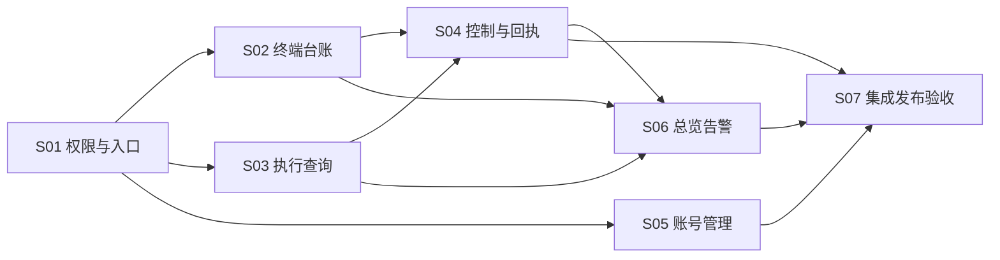

# 平台管理后台实施计划

目标：按可独立验收的纵向功能切片交付内部管理后台。架构：复用认证和现有服务，新增平台权限、安装台账和操作/告警闭环。技术栈：Go/sqlc/PostgreSQL、Next.js、React Query、共享 core/views/ui。

状态：本轮仅设计；父任务和 7 个子任务都保持 planning，未授权实现。实施时遵守 Trellis 主流程，先评审最新文档，再启动满足依赖的子任务；不得把创建任务视为代码实施已开始。

## 1. 任务依赖

| 切片 | 实际子任务 | 交付范围 | 父验收 |
| --- | --- | --- | --- |
| S01 | [身份权限与入口](../10-01-platform-admin-access/prd.md) | 组织/角色/审计基础、JWT来源约束、bootstrap、管理shell与me | AC01、AC02、AC11 |
| S02 | [终端台账与上报](../10-01-platform-admin-installations/prd.md) | 安装接入、daemon关联、三状态轴、版本/分组只读、详情 | AC04、AC05、AC12 |
| S03 | [任务与执行查询](../10-01-platform-admin-executions/prd.md) | 全局元数据分页、来源/尝试关系、内容权限、列表详情 | AC06、AC10 |
| S04 | [控制与回执](../10-01-platform-admin-controls/prd.md) | operation、单次取消、停止/恢复接单、ack/恢复、审计 | AC07、AC08 |
| S05 | [账号管理与恢复](../10-01-platform-admin-accounts/prd.md) | 账号目录、禁用/恢复、强制改密、最后管理员、目标撤销 | AC03、AC11 |
| S06 | [总览与告警](../10-01-platform-admin-observability/prd.md) | 统一KPI、固定规则、告警处置、健康、审计列表和只读设置 | AC09、AC10 |
| S07 | [集成与发布验收](../10-01-platform-admin-acceptance/prd.md) | 安全/兼容/容量/原生验收、迁移回退、发布手册 | AC01–AC13 |

S02/S03/S05 仅在 S01 的 schema/API/授权基础稳定且验证后可并行。S06 的静态页面与纯聚合可提前开发，但端到端验收依赖 S04；S07可提前准备夹具，最终验收依赖全部切片。

## 2. 共享文件所有权

- S01 拥有 router 中 admin group、auth/platform角色公共接口、organization/角色/账号禁用字段与audit/operation基础schema、通用幂等创建/按actor-key查询接口、admin shell/Query作用域契约。S05补账号操作UI与行为，S04补operation控制流程，不重复建基础表或按key查询入口。
- S02 拥有安装接入/绑定schema及 desktop↔daemon身份协商；S04 在其稳定API上扩展，不重命名同一绑定模型。
- S03 拥有 task/issue 管理DTO与SQL投影；S04 扩展动作而不重写只读查询。
- S05 复用 S01 平台服务和审计；对 auth/password 文件的写入必须与 S01 串行。
- router、sqlc配置/生成、core 导出和 locale 注册由当批集成人统一处理。并行子任务提交修改建议，避免相互覆盖。
- 迁移编号在集成时统一分配；不能两个切片用同一编号或为同一实体重复建表。每个并发索引单独文件。

## 3. 每个切片的实施节奏

1. 读取自身 prd/design/implement、父设计及 JSONL 指定spec，核查上游验证证据和本地改动，记录源码基线。
2. 在权威层补充失败回归，先确认失败来自缺行为而不是环境；尤其是授权、竞态、缺字段与幂等。
3. 实现 SQL/服务/接口/schema/query/页面的最小纵向链路；状态与副作用遵守事务和提交后规则。
4. 运行定向回归；对实际变更包运行 lint/typecheck/test/static checks，遇到失败修复后继续。
5. 对照父AC与切片AC做跨层验证，记录 verification.md 和真实未测项，更新源spec中已证实知识。
6. 按可审阅单元提交，遵守 Lore 与 conventional prefix；只包含该切片拥有文件，不夹带用户工作。不在本规划阶段提交实现或发布。

具体文件与切片步骤已写入各子任务 implement.md；全量验证命令和模式见 [test-spec.md](test-spec.md)。

## 4. 风险前置顺序

- 在角色启用前完成 PAT→JWT 转换约束、历史转换JWT的版本撤销、CLI正常登录与PAT续期兼容。
- 在开启 terminal control 前完成安装证明、daemon绑定与所有领取路径门禁，不能先上按钮再补后端检查。
- 在放开私有内容链接前验证原资源鉴权和脱敏DTO；读权限不得暗中扩张调用权限。
- 在角色/账号写入前具备原子审计和最后管理员保护；操作A到B不得撤销A会话。
- 在后台指标上线前统一时区、时间窗、任务/尝试区分与未知数据语义。
- S02先固定enroll/bind判别字段、原字节签名信封及同账号双主体约束，再由S04使用绑定。S01先交付通用actor/key幂等创建及找回接口，供S04与S05并行复用；S04只负责控制特有的并发取消请求记录与共享根确认。

## 5. 后续阶段分解（仅路线图）

| 阶段 | 待拆切片 | 进入条件 |
| --- | --- | --- |
| P2 | 功能/模型/工具策略，配额，独立统计，升级批次，外部告警通知 | P1闭环验证、真实容量与使用数据已收集 |
| P3 | 多组织管理员与隔离，组织策略/配额，支持访问授权 | 明确客户边界及身份模式，完成跨组织安全设计和隔离测试 |
| 独立商业需求 | 订阅、账单、对账、SSO | 用户确认商业/企业接入需求，不作为本轮隐含承诺 |

不提前批量创建 P2/P3 空任务；在需求明确后以本父任务的范围为依据拆分。

## 6. 本轮规划验收

验证父子任务关系、全为 planning、JSONL真实条目、链接与现有spec路径、需求AC覆盖和DAG无环；独立审阅后处理实质问题。最终记录 verification.md 与 research/design-review.md，不运行无关业务测试或修改用户侧边栏改动。
