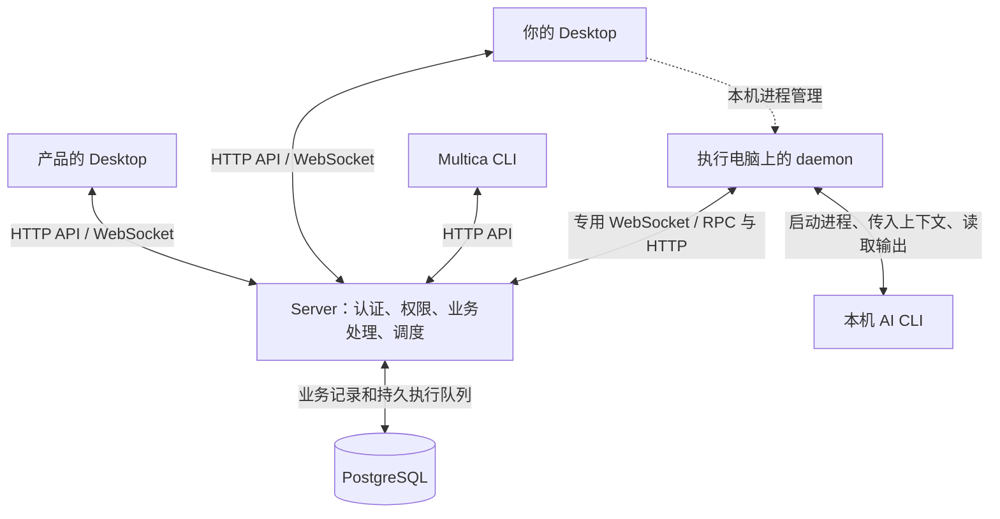

# 跨账号任务流转与共享 AI 协作：讨论记录

## 记录范围与阅读方式

- 日期：2026-10-10。
- Trellis 任务：`10-10-cross-workspace-collaboration`。
- 记录来源：本次会话中的需求分析、`grill-me` 逐项讨论和源码核查。
- 当前状态：保存讨论，处于 `planning`；未实现本功能。
- 当前需求以 [PRD](prd.md) 为准。本文保留讨论演进、被替代的选择、架构依据和不确定项。
- 这是整理后的讨论记录：用户关键发言以引文保留，助手回复为摘要；不是包含所有工具输出和过程消息的逐字转录。
- 用户最初要求先讨论、不创建任务；最终明确要求新建 Trellis 任务并保存为 Markdown。因此此次只建立规划记录，没有开始产品实现。

## 一、原始需求

用户希望在已有个人账号的基础上，让不同岗位在自己的工作台接续处理单子：产品创建并派给开发，开发在待办中收到，可以评论、继续处理，再交给其他人或与 AI 协作。

最初描述中的关键选项：

> 再转给产品
>
> 继续和 Aiden 协同
>
> 派给其他人

用户要求分析可行性和基于当前架构的实现难度，并使用 `grill-me` 探讨需求。

### 术语纠正

用户随后问：

> Aiden是什么

助手说明：曾把原文中的 Aiden 当作某个 AI 智能体的名字，但并未确认其含义，也没有在代码核查中确认一个名为 Aiden 的内置概念。用户没有进一步确认这个专名；后续统一讨论 AI 智能体，不以 Aiden 作为产品实体、预置账号或实现依赖。

用户另问过桌面端 `demo`、CLI 与 Server 的交互。助手当时按可能指 daemon 理解，同时解释了 Desktop 与 daemon 两者；该用词未被单独确认。本文使用代码中已明确的 Desktop、daemon、Multica CLI 和底层 AI CLI。

## 二、关键问答与决策演进

### 1. 本轮先讨论，不创建任务

用户选择：

> 先分析并用 grill-me 探讨，暂不创建任务

助手保持只读源码分析，未把讨论直接转成实现。直至本轮最后用户主动要求创建 Trellis 任务。

### 2. 不强制共用工作空间

用户明确：

> 是否共用一个工作空间，不强制。大概率是每个人有每个人的工作空间 。这种情况怎么办呢？

讨论由同空间成员互派转为支持跨空间协作。保留个人工作空间，并通过账号级工作台和单据授权访问共享任务，是提出的方案方向。

需要区分：用户确认了不同工作空间；所有人连接同一套 Server 是当前分析前提，不等于用户确认了跨多个独立 Server 的互通范围。

### 3. 如何在自己的工作台看到其他空间派来的任务

用户追问：

> 比如说，不用一个工作空间，但是呢，我能看到派给我的任务，这是怎么实现的？

助手提出：工作空间记录任务归属，单据权限决定谁可以参与，个人工作台按账号汇总待办。产品创建的任务可以保留在空间 A，向你的账号共享后出现在你的工作台中；你看到同一张任务，评论与历史写回同一份记录。

这是拟新增的数据访问路径。现有系统主要依赖工作空间成员身份，不能仅添加一个前端列表就视为跨空间共享已经完成。

### 4. 明确 Desktop、CLI、daemon、Server 的分工

用户问：

> 从技术架构上去实现的话，这个桌面端 demo、CLI 以及后端的 server，这个数据是怎么交互的？

源码核查确认：Desktop 和 Multica CLI 都能直接访问 Server；daemon 负责领取 AI 执行并调用本机工具；业务任务、评论、权限、通知和执行记录以 Server 数据库为依据。人类派单无需经过接收人的 daemon。

详细交互见本文第四节。

### 5. 过程可见性从两个选项中收敛到共享过程

早期比较：

- A：默认只共享公开评论和提交结果，内部讨论留在处理人的空间。
- B：本单专属讨论和系统已记录的 AI 执行过程向参与者共享。

用户询问选择 B 的复杂度，后续共同控制 AI 的讨论在 B 的基础上继续。当前需求采用 B；A 保留在记录中作为早期比较，不是最终默认。

助手建议将共享范围限定为本单专属协作会话，而不是把个人账号全部历史聊天或整个工作空间自动公开。准确会话模型仍需技术设计。

### 6. 产品权限曾选择只评论，随后被明确替换

用户最初回答：

> 产品看到过程之后，只能评论和跟进

随后明确修改：

> 产品看到过程之后  修改为  也能直接指挥、停止正在执行的 AI

最终规则是允许获授权协作者直接指挥和停止本单 AI。早期“产品评论不能触发执行”的限制已经被替代，不应写入最终需求。

共同控制本单与调用任意私有智能体、访问整台电脑是不同的授权范围。既有私有智能体调用门禁和任务凭据范围仍需在技术设计中正确衔接。

### 7. 转交对象不限于产品，两种交接目的都需要

用户纠正：

> 这个地方转交的不一定是产品，就是转给另外一个人，转给另外一个账号，比如是测试，或者是另外的开发
>
> 可能会有需要补充信息，或者是我处理完了需要提交给他，这两种情况都有。

最终采用通用账号转交。转交可以是请接收人补充信息，也可以是把阶段结果交给对方继续处理。把任务交给测试或另一位开发不自动等于整单完成。

“当前处理人”“协作者”“处理环节”需要分开表达，不能把产品、开发、测试直接变成三种互不兼容的登录账号类型。

### 8. 忙碌时的新指令采用排队策略

用户在上述回复中选择：

> A：新指令排队，当前一轮结束后执行；需要中止时直接点“停止”。

最终不要求首版对所有 AI CLI 实现运行中实时插话。新指令进入相应 AI 会话的队列，当前一轮结束后处理；停止为独立操作。

### 9. 停止当前执行，同时挂起后续队列

用户选择：

> 停止当前执行，同时挂起后续指令，等待有人明确恢复

据此确定：排队指令保留；挂起期间新增指令继续等待；明确恢复之前不自动执行。刷新界面、重新登录或网络重连都不被视为恢复指令。

助手提出的技术要求：先阻止后续领取，再停止当前执行，避免停止期间队列抢跑；界面区分正在停止与执行端确认停止。状态及回执方案还需形成设计。

### 10. 恢复从下一条开始，不自动重做被停止的指令

用户选择：

> 从下一条排队指令开始

被停止的指令保留停止记录。恢复解除后续队列的挂起，从下一条开始；如需继续被打断的工作，应由后续显式操作表达，而不是自动复活进程或重试原指令。

### 11. 转交后原协作者保留控制权限

助手询问：开发交给测试后，是保留本单 AI 控制权，还是只保留查看和评论。

用户回答：

> 保留

因此，产品、开发、测试等已经获授权的协作者不因普通转交自动失去本单的指挥、停止和恢复权限。转交改变当前处理责任，不等于退出协作。谁能显式撤权或移除协作者尚未讨论完毕。

### 12. 转交不改变运行和队列状态

用户选择：

> 保持执行和队列的原有状态

最终规则：运行中的继续运行，挂起的仍挂起。转交不自动停止、恢复或重新启动 AI。它与前面的保留协作权限规则共同说明，负责人流转与执行生命周期应独立维护。

### 13. 授权创建 Trellis 任务并保存讨论

用户最终要求：

> 新建个trellis任务，然后请将这个讨论保留到 Markdown中

本次据此创建规划任务及本记录，不将保存文档理解为启动产品实现。

## 三、最终流程示例

### 跨账号转交

产品在空间 A 创建需求，交给使用空间 B 的开发。开发通过个人工作台处理，信息不足时交给某个账号补充，再继续开发。阶段结果交给测试，测试发现问题后可以交给另一位开发修复。

各次转交保留同一业务任务的身份、评论和交接历史；已有协作者保留权限。任务不应在每次转交时被复制为彼此竞争的多个业务事实来源。

### 指令、停止、恢复与转交

| 时刻 | 当前执行 | 后续指令 | 处理责任与协作权限 |
| --- | --- | --- | --- |
| 开发处理任务 | 指令 1 运行 | 2、3 排队 | 开发负责，产品和开发可协作 |
| 转交给测试 | 1 继续 | 2、3 保持排队 | 测试负责，产品和开发保留权限 |
| 某位协作者点击停止 | 1 收到停止请求，等待执行端确认 | 2、3 挂起 | 不因停止改变业务负责人 |
| 挂起时新增指令 4 | 不启动新执行 | 2、3、4 等待 | 有权限参与者仍可讨论 |
| 挂起时再次转交 | 保持停止状态 | 保持挂起 | 新处理人接手，旧协作者保留权限 |
| 明确恢复 | 从 2 开始 | 随后 3、4 | 1 不自动重试；控制操作留痕 |

上表描述目标行为，不是对现有版本完成情况的声明。多智能体或多个并发会话的精确停止范围仍需设计。

## 四、当前架构及拟新增交互

### 当前架构主干

- Desktop 的任务页面通过共享 API 客户端访问 Server。界面数据由 TanStack Query 缓存；工作台布局、筛选等客户端状态由 Zustand 管理。
- Desktop 管理本机 daemon 时，经 Electron IPC 到主进程，再通过 Multica CLI、本机控制接口等机制管理守护进程。
- Multica CLI 的业务命令直接访问 Server；`multica daemon start` 等命令管理守护进程。Multica CLI 与 daemon 启动的底层 AI CLI 是两个概念。
- Server 保存业务任务、评论、通知、权限及执行记录，PostgreSQL 是事实来源。工作空间通常通过数据库记录中的 `workspace_id` 区分。
- 本机代码目录和工具进程位于执行电脑；任务上下文、执行消息和结果会回传 Server，不能把本地执行理解为所有内容只存在本机。

### 当前 AI 执行链路

1. Server 将 AI 执行写入 PostgreSQL 的 `agent_task_queue`。
2. Server 通过 daemon 专用 WebSocket 发出 `task_available` 唤醒提示。
3. daemon 在能力协商支持时通过 `tasks.claim` WebSocket RPC 领取；必要时回退 HTTP。不能把当前协议描述为 WebSocket 永远只通知、HTTP 永远负责领取。
4. Server 返回上下文、智能体配置和绑定 task、agent、workspace 的任务凭据。
5. daemon 准备工作目录，调用对应 provider 的本机 AI CLI，读取流式输出。
6. daemon 当前通过 HTTP 上传执行消息和完成、失败结果；Server 入库并向有权接收事件的客户端推送。
7. AI 执行中调用 Multica CLI 时，可使用任务凭据直接向 Server 评论或更新任务，而不是所有操作都经 daemon 转发。

持久任务队列与终态回传已有可靠性机制，但不能据此保证每条中间流式消息绝不丢失。共享过程指系统实际记录的过程；完整审计级消息交付保证未在本轮确认。

### 跨空间派单的方案方向

以下是拟新增能力，不是已经存在的接口或最终表结构：

1. 产品提交带接收账号的转交请求，Server 验证其操作权限。
2. Server 协调更新当前处理人、单据授权和交接记录；通知由持久业务状态驱动。
3. 接收人的账号级工作台查询获授权且需要自己处理的任务，覆盖不同来源空间。
4. 单据详情、评论、附件、执行记录和实时订阅使用一致的授权依据。
5. 待办可在重新登录后通过查询恢复，不能只依赖一次 WebSocket 通知。

一种讨论过的实现路径是保留原任务的空间归属并增加按单授权。是否复用现有任务扩展授权、怎样建模参与关系和路由，应在 `design.md` 中决策；此处不宣称需要新增独立服务。

### 在个人空间执行并共享过程的方案方向

现有任务、智能体、运行时和任务 token 都存在工作空间边界。空间 A 的任务不能简单绕过校验直接调用空间 B 的私有智能体。

讨论提出可在空间 B 使用关联的内部任务或会话承载执行，由 Server 传递已授权的需求上下文，并将本单允许共享的过程、结果关联回空间 A 的业务任务。协作事实保持一份，执行可以有多次记录。

该关联机制仍是候选设计。共同控制需要落实资源拥有者授权、控制者身份和执行凭据归属；不得把“看得到共享任务”直接等同于可以使用原处理人的完整凭据、全部运行时或其他私有资源。

### 停止与队列挂起的方案方向

用户选择的语义要求持久队列门禁：先阻止后续任务领取，再处理当前执行停止；收到执行端回执后展示真实停止结果。明确恢复后开放后续领取，跳过已停止指令。

现有停止接口可以复用，但本轮尚未验证或实现满足全部上述语义的会话级持久挂起机制。并发领取、在途停止、终态竞争、重复请求和过期恢复指令都需要设计及验证。

## 五、源码核查依据

源码核查基于当时 `codex/projects-p1` 工作副本，HEAD 为 `cfa0254eb`，工作区同时存在其他任务的未提交改动。下列行号是核查时定位；后续以符号和实际源码为准。本轮没有启动服务或运行真实 AI，也没有通过测试证明拟新增能力已实现。

| 结论 | 代码入口 |
| --- | --- |
| 用户与空间成员关系已经分离，一个用户可加入多个空间 | [member.sql](../../../server/pkg/db/queries/member.sql#L10)、[workspace.sql](../../../server/pkg/db/queries/workspace.sql#L1) |
| 用户名密码登录已存在，设备身份与人员账号是不同模型 | [auth_password.go](../../../server/internal/handler/auth_password.go#L128)、[auth_device.go](../../../server/internal/handler/auth_device.go#L25) |
| 无邮箱账号可以通过共享邀请链接加入空间；邮件邀请不能直接视为用户名邀请 | [share_link.go](../../../server/internal/handler/share_link.go#L264)、[invitation.go](../../../server/internal/handler/invitation.go#L72) |
| 现有任务加载按任务与空间共同限定 | [handler.go：loadIssueForUser](../../../server/internal/handler/handler.go#L1102) |
| 指派成员要求属于任务空间；指派智能体还需要调用权限 | [issue.go：validateAssigneePair](../../../server/internal/handler/issue.go#L4133) |
| 我的任务已有按当前用户关系筛选的页面，但仍置于空间上下文 | [my-issues-page.tsx](../../../packages/views/my-issues/components/my-issues-page.tsx#L15)、[my-issues-view-store.ts](../../../packages/core/issues/stores/my-issues-view-store.ts) |
| 指派、评论、订阅和变更历史已有基础 | [notification_listeners.go](../../../server/cmd/server/notification_listeners.go#L688)、[subscriber_listeners.go](../../../server/cmd/server/subscriber_listeners.go#L81)、[activity_listeners.go](../../../server/cmd/server/activity_listeners.go#L114) |
| 收件箱已有跨空间未读摘要，但完整列表按空间读取 | [inbox/queries.ts](../../../packages/core/inbox/queries.ts#L5)、[inbox.sql](../../../server/pkg/db/queries/inbox.sql#L1) |
| 评论提及智能体可创建独立执行，保留人类负责人；目标仍被限定在本单空间 | [task.go：EnqueueTaskForMention](../../../server/internal/service/task.go#L1351)、[comment.go](../../../server/internal/handler/comment.go#L3164) |
| 当前普通转派或修改任务为取消状态不隐式停止正在进行的 AI 执行 | [issue.go](../../../server/internal/handler/issue.go#L4097)、[issue_reassign_no_cancel_test.go](../../../server/internal/handler/issue_reassign_no_cancel_test.go)、[issue_cancel_status_no_cancel_test.go](../../../server/internal/handler/issue_cancel_status_no_cancel_test.go) |
| Desktop 直接使用带登录和空间信息的共享 API 客户端 | [client.ts](../../../packages/core/api/client.ts#L1061)、[core-provider.tsx](../../../packages/core/platform/core-provider.tsx#L73) |
| Desktop 登录后同步本机 daemon 身份及 Server 目标，再自动启动 | [daemon-login-sync.ts](../../../apps/desktop/src/renderer/src/platform/daemon-login-sync.ts#L21) |
| 客户端实时连接当前仍依赖活动空间，已有用户范围广播基础 | [provider.tsx](../../../packages/core/realtime/provider.tsx#L79)、[realtime/hub.go](../../../server/internal/realtime/hub.go#L383) |
| 执行记录实时订阅对空间及私人会话创建者有访问门禁 | [scope_authorizer.go](../../../server/cmd/server/scope_authorizer.go#L47) |
| Multica CLI 业务命令直接调用 Server API | [cmd_issue.go](../../../server/cmd/multica/cmd_issue.go#L1463)、[cli/client.go](../../../server/internal/cli/client.go#L46) |
| daemon 领取任务采用 WebSocket RPC 优先和 HTTP 回退 | [wsrpc.go](../../../server/internal/daemon/wsrpc.go#L308)、[daemon_rpc.go](../../../server/internal/handler/daemon_rpc.go#L48) |
| AI 执行有持久队列和 task 范围凭据 | [agent.sql](../../../server/pkg/db/queries/agent.sql#L337)、[handler/daemon.go](../../../server/internal/handler/daemon.go#L1881) |
| AI provider 的统一接口提供执行、消息和结果，不代表已有通用运行中追加指令接口 | [agent.go：Backend、Session](../../../server/pkg/agent/agent.go#L17) |
| 执行消息和终态通过 daemon HTTP 客户端回传 | [daemon/client.go](../../../server/internal/daemon/client.go#L502) |
| 已有停止 API 和执行端状态观察、中止机制 | [handler/daemon.go：CancelTask](../../../server/internal/handler/daemon.go#L4991)、[daemon.go：watchTaskCancellation](../../../server/internal/daemon/daemon.go#L5040) |
| 重新运行仍需调用权限，不能仅凭任务可见性调用私有智能体 | [task_lifecycle.go](../../../server/internal/handler/task_lifecycle.go#L209) |

补充阅读：[项目架构](../../../apps/docs/content/docs/developers/architecture.zh.mdx)、[守护进程与运行时](../../../apps/docs/content/docs/daemon-runtimes.zh.mdx)、[根项目规则](../../../CLAUDE.md)。

## 六、难度判断及估算的适用范围

- 同一空间内的成员互派、评论、通知已有主要能力，基础流转难度较低。
- 各人独立空间、按单共享、账号级待办、个人运行环境关联执行，整体属于中高复杂度。
- 讨论中曾用“比 A 多约 20%～40%”粗估 B 的共享过程展示增量。该数字没有实施拆分依据，而且不包含后来扩大为跨账号共同控制及停止、挂起、恢复的完整需求；不能当作当前总工作量或排期承诺。
- 用户选择排队而非实时插话，减少了统一适配各 AI CLI 实时输入能力的范围；保留原执行状态的转交规则也与现有机制更接近。
- 主要投入预计在 Server 的授权、跨空间关联、持久队列控制与一致性；共享前端及 CLI 接入同一套服务规则；daemon 的领取、执行、回传链路可以复用，但不能预先承诺无需修改。

## 七、后续继续时的边界

下一次继续应先读取 [PRD 的开放问题](prd.md#继续规划时需要解决的问题)，再展开技术设计。不要重新询问已确认的选择，也不要恢复已经被用户替换的只评论权限或自动重试策略。

尚未确定的 API、表结构、队列粒度、资源控制授权、生命周期、客户端覆盖及正式排期，应进入后续设计和计划，不能由本记录中的示意图自动推导为已批准方案。

本次保存结果为 `prd.md` 与 `discussion.md`，并在 `implement.jsonl`、`check.jsonl` 中登记本次调研和已有权限、跨层规范。`design.md`、`implement.md` 及最终上下文清单将在继续规划时完善。任务保持 `planning`。
