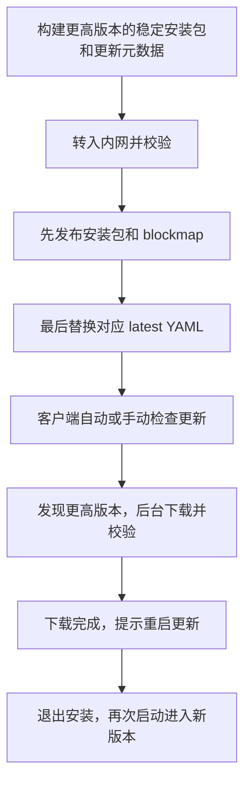

# 桌面端内网部署与升级操作手册

更新日期：2026-09-24。

本手册用于首次部署桌面更新下载服务，以及后续发布新版本。内网服务器通过 Nginx 提供静态文件下载，客户端配置固定的 `updateUrl`。以后升级只发布新文件并切换更新元数据，不需要逐台修改客户端 URL，也不需要重启 Nginx。

本文只涉及桌面程序升级。业务服务、数据库和独立安装的 CLI 按[服务端离线升级文档](offline-upgrade.zh-CN.md)执行。

## 0. 交付内容与日常入口

这一部分交付的是桌面安装包的下载和发布服务：安装包保存在宿主机，Nginx 只读提供文件，管理员先发布产物再切换 `latest*.yml`，已配置更新源的客户端自行发现和下载新版本。业务 API 不参与文件发布。

| 要做的事情 | 使用入口 | 是否需要重启 |
| --- | --- | --- |
| 首次部署下载服务 | 本文第 2 节 | 启动独立 Nginx 容器 |
| 发布新的桌面版本 | 本文第 4 节的 `collect`、`publish`、`verify` | 无需重启 Nginx；客户端安装新版需要退出或重启 |
| 修改客户端更新源 | 本文第 5 节 | 完整退出并重新打开客户端 |
| 修改监听、镜像或存储位置 | 修改 `updates.env`，再执行 `start` | Compose 按配置重建下载容器 |
| 升级内网后端、Web 和数据库 | [服务端离线升级](offline-upgrade.zh-CN.md) | 由服务端升级脚本处理，与桌面发包分别执行 |

日常统一使用 [desktop-updates.sh](../scripts/desktop-updates.sh)。它自动读取脚本所在部署根目录的 `updates.env`，也支持显式指定配置文件：

```bash
bash scripts/desktop-updates.sh --help
bash scripts/desktop-updates.sh --env-file /opt/multica-updates/updates.env status
```

| 命令 | 用途 |
| --- | --- |
| `export-image OUTPUT PLATFORM` | 联网机器准备指定服务器架构的 Nginx 离线镜像归档 |
| `start` / `stop` / `status` / `logs` | 启停和检查独立下载服务；停止保留安装包 |
| `collect SOURCE DESTINATION` | 从构建目录收集并校验完整发布文件 |
| `publish SOURCE` | 校验后发布到配置的存储，保留历史文件和元数据备份 |
| `verify METADATA --expected-version VERSION` | 从配置的 HTTP 地址实际下载并校验指定通道与版本 |
| `configure --config PATH` | 备份并更新指定客户端配置文件的 `updateUrl` |

`collect` 和 `publish` 仅在明确测试预发布包时追加 `--allow-prerelease`。`verify` 默认检查 `latest.yml`，可以检查测试版本，但不会把测试版本认定为正式发布。

## 1. 部署约定

以下均为示例，请替换为实际环境的值：

| 项目 | 示例 |
| --- | --- |
| 下载服务器 | Linux，内网 IP 为 `10.10.10.20` |
| 下载端口 | `18080` |
| 客户端更新地址 | `http://10.10.10.20:18080/desktop` |
| Nginx 部署配置目录 | `/opt/multica-updates` |
| 安装包持久化存储 | `/srv/multica-updates` |
| 待发布文件目录 | `/srv/incoming/desktop-0.5.1-windows-x64` |
| 本次示例版本 | `0.5.1`，应高于客户端已安装版本 |

下载服务器需要 Docker Engine 和 Docker Compose 插件。Nginx 本身不需要 Node.js；使用仓库里的收集、发布工具时，执行工具的机器需要仓库和已经准备好的项目依赖。完全隔离的环境应提前准备镜像、依赖和安装包。

| 执行位置 | 所需条件 |
| --- | --- |
| 下载服务器，仅运行 Nginx | Bash、Docker、Compose，以及第 2.1 节的最小部署文件 |
| 构建机器 | 对应平台的构建和签名工具链、仓库及依赖 |
| 发布或自动校验机器 | 仓库、Node.js 22.18+ 和项目依赖；通过 Shell 读取 env 文件时还需要 Compose CLI |
| 普通客户端电脑 | 已安装桌面客户端；手工合并 JSON 不需要 Node.js |

发布机器可以就是下载服务器，也可以是挂载了同一存储的内网运维机。仅复制最小 Nginx 部署文件不包含 Node 发布工具；需要使用 `collect`、`publish`、`verify` 时，执行环境必须保留仓库中的 `apps/desktop/scripts/` 及其依赖。依赖应按执行机器的操作系统准备，不要直接复制其他系统的 `node_modules`。

长期使用建议配置固定内网域名，并通过已有反向代理提供客户端信任的 HTTPS 证书。更新文件应能直接下载，不能跳转到浏览器登录页。

## 2. 首次部署 Nginx

### 2.1 准备配置文件

把仓库中的 [Compose 配置](../docker-compose.desktop-updates.yml)、[Nginx 配置](../deploy/desktop-updates/nginx.conf)、[管理脚本](../scripts/desktop-updates.sh) 和 [环境配置模板](../deploy/desktop-updates/updates.env.example) 复制到服务器，保留相对目录结构：

```text
/opt/multica-updates/
├── docker-compose.desktop-updates.yml
├── updates.env
├── scripts/
│   └── desktop-updates.sh
└── deploy/
    └── desktop-updates/
        ├── nginx.conf
        └── updates.env.example
```

`updates.env` 在下一步创建。下载服务使用独立的 Compose 项目 `multica-desktop-updates`。

可以在仓库根目录把最小运行文件一次打包，再将归档转入内网：

```bash
tar -czf /tmp/multica-desktop-download-service.tar.gz \
  docker-compose.desktop-updates.yml \
  deploy/desktop-updates/nginx.conf \
  deploy/desktop-updates/updates.env.example \
  scripts/desktop-updates.sh
```

在服务器解压：

```bash
mkdir -p /opt/multica-updates
tar -xzf multica-desktop-download-service.tar.gz -C /opt/multica-updates
```

### 2.2 在联网机器准备镜像

以下以 Linux x64 服务器为例；目标服务器为 ARM64 时，将 `linux/amd64` 改为 `linux/arm64`。这指的是 Nginx 服务器架构，与所分发的桌面安装包架构无关。

导出机的 Docker 需要支持 `docker image inspect --platform` 和 `docker save --platform`（API 1.49+，并使用匹配的 CLI；本次实测为 Docker 29.2.1）。这样即使在 ARM Mac 上准备 x64 镜像，也会明确选择目标平台。旧版 Docker 应先升级导出环境，不要去掉平台参数后把未经确认的镜像交给内网服务器。

```bash
bash scripts/desktop-updates.sh export-image \
  /tmp/nginx-desktop-updates-amd64.tar linux/amd64
```

脚本从 Compose 中读取固定镜像 digest，按指定架构拉取、设置含架构的本地标签，再导出到新归档。已有的输出文件不会被覆盖。记录成功输出的镜像标签，稍后写入 `updates.env`；当前 x64 示例为 `multica-desktop-nginx:985220252f38-amd64`。

把生成的归档转入内网服务器，再执行：

```bash
docker load -i nginx-desktop-updates-amd64.tar
```

离线导入后使用脚本输出的本地标签启动，避免依赖 `docker save/load` 是否保留 RepoDigest。只有首次部署或更新 Nginx 镜像时需要重新导入；日常发布桌面安装包无需重新导入镜像。

### 2.3 保存固定配置并启动

首次部署时，可以从模板创建 `/opt/multica-updates/updates.env`，然后按实际环境编辑；已有配置不要再次用模板覆盖：

```bash
cd /opt/multica-updates
test -e updates.env || cp deploy/desktop-updates/updates.env.example updates.env
```

示例配置如下，其中镜像以导出脚本实际输出为准：

```dotenv
DESKTOP_UPDATES_IMAGE=multica-desktop-nginx:985220252f38-amd64
DESKTOP_UPDATES_BIND=0.0.0.0
DESKTOP_UPDATES_PORT=18080
DESKTOP_UPDATES_STORAGE=/srv/multica-updates
DESKTOP_UPDATES_URL=http://10.10.10.20:18080/desktop
```

`0.0.0.0` 表示监听服务器所有 IPv4 网卡，也可以改成指定的内网 IP。客户端 URL 仍填写服务器的实际 IP 或域名。

在服务器执行，目录创建需要相应权限：

```bash
cd /opt/multica-updates
bash scripts/desktop-updates.sh start
bash scripts/desktop-updates.sh status
```

`start` 创建存储目录，使用已导入镜像启动并等待健康检查，不会从公网拉取。容器只读挂载 `public/`，停止或重建容器不会删除宿主机上的安装包。

后续管理自动复用同一份 `updates.env`。需要用其他配置时，在命令前传 `--env-file /绝对路径/updates.env`。配置文件按 Docker Compose 的 dotenv 规则读取，不会作为 Shell 执行。进程中已有的同名环境变量按 Compose 规则优先；长期运维应避免遗留的临时 `export DESKTOP_UPDATES_*` 覆盖配置文件。

`DESKTOP_UPDATES_URL` 是客户端实际可访问的完整目录地址，用于 `verify` 和 `configure`；它不会改变 Nginx 的端口监听。首次部署后请记录服务器地址、配置文件位置、存储位置和镜像标签，后续不要仅凭默认值操作。

### 2.4 检查内网访问

在防火墙中允许内网终端访问 TCP `18080`，从另一台内网电脑执行：

```bash
curl -fsS http://10.10.10.20:18080/health
```

预期返回 `ok`。浏览器打开 `/desktop/` 返回 `403/404` 是正常现象，因为目录列表已关闭；需要使用具体文件地址验证下载。

## 3. 安装包放在哪里

Nginx 对外提供 `/srv/multica-updates/public/` 下的文件。以 Windows x64 为例：

```text
/srv/multica-updates/
├── public/
│   ├── latest.yml
│   ├── multica-desktop-0.5.0-windows-x64.exe
│   ├── multica-desktop-0.5.0-windows-x64.exe.blockmap
│   ├── multica-desktop-0.5.1-windows-x64.exe
│   └── multica-desktop-0.5.1-windows-x64.exe.blockmap
├── staging/
└── backups/
```

发布工具管理 `staging/` 和 `backups/`，这两个目录不对客户端开放。不要将会被下次构建清空的 `apps/desktop/dist` 直接挂载为长期存储。

文件与 URL 的对应关系：

```text
/srv/multica-updates/public/latest.yml
→ http://10.10.10.20:18080/desktop/latest.yml

/srv/multica-updates/public/multica-desktop-0.5.1-windows-x64.exe
→ http://10.10.10.20:18080/desktop/multica-desktop-0.5.1-windows-x64.exe
```

`latest*.yml` 包含版本号、安装包文件名、大小和校验值，必须使用本次构建生成的文件。不要只复制安装器，也不要手工修改 YAML 的版本号或校验值。

| 客户端 | 更新元数据 | 主要文件 |
| --- | --- | --- |
| Windows x64 | `latest.yml` | `.exe`、生成的 `.exe.blockmap` |
| Windows 32 位 | `latest-ia32.yml` | 对应架构的 `.exe`、blockmap |
| Windows ARM64 | `latest-arm64.yml` | 对应架构的 `.exe`、blockmap |
| macOS Apple Silicon | `latest-mac.yml` | `.zip`、生成的 blockmap，以及首次安装用的 `.dmg` |
| macOS Intel | `latest-x64-mac.yml` | `.zip`、生成的 blockmap，以及首次安装用的 `.dmg` |
| Linux x64 | `latest-linux.yml` | 本次构建实际分发的包和元数据引用的文件 |
| Linux ARM64 | `latest-linux-arm64.yml` | 对应架构的包和元数据引用的文件 |

macOS 自动更新需要 ZIP，只有 DMG 不够。Linux 安装权限和升级行为取决于包格式，需要按实际交付格式验收。所有平台都应保留原始文件名，不能把其他架构的元数据改名为 `latest.yml`。

## 4. 每次升级时发布新版本

### 4.1 构建并收集完整产物

在具备构建工具链和依赖的机器上，从仓库根目录执行。下面以稳定版本 `0.5.1`、Windows x64 为例：

```bash
MULTICA_DESKTOP_VERSION=0.5.1 \
  pnpm --filter @multica/desktop package -- --win --x64 --publish never

bash scripts/desktop-updates.sh collect \
  apps/desktop/dist dist/desktop-release-0.5.1-windows-x64
```

`--publish never` 不上传公网发布源。构建签名仍按目标平台的正式发布要求准备，指定版本号不能替代签名和安装验收。

收集工具会验证元数据引用、大小和 SHA-512。把收集出的整个目录转入内网，例如 `/srv/incoming/desktop-0.5.1-windows-x64`。多架构应逐次构建、收集到不同目录，避免后续构建清空之前的产物。

正式升级使用高于客户端当前版本的稳定版本。`-dirty` 等预发布包仅用于明确的开发验证，不应作为正式稳定升级包。

### 4.2 优先使用发布工具

在已经准备好仓库及 Node.js 依赖的内网发布环境中，从仓库根目录执行：

```bash
bash scripts/desktop-updates.sh \
  --env-file /opt/multica-updates/updates.env \
  publish /srv/incoming/desktop-0.5.1-windows-x64
```

脚本读取 `DESKTOP_UPDATES_STORAGE`，工具写入其 `public/` 子目录。它必须与 Nginx 挂载的是同一份存储；如果工具在另一台机器执行，需要挂载下载服务器的同一目录，并用该机器专用的 env 文件填写实际挂载路径。该存储需要支持硬链接和同目录原子重命名。不要仅因为两台机器都存在 `/srv/multica-updates`，就认为它们指向同一份文件。

工具会重新校验文件，拒绝用不同内容覆盖已有的版本文件，保留旧安装包和元数据备份，先发布完整产物，最后原子替换每个平台的 YAML。不同平台的元数据分别切换，不是所有平台同时切换的事务。

### 4.3 下载服务器只部署 Nginx 时

如果服务器没有 Node.js 和项目依赖，在发布机先完成收集与校验，再通过现有文件传输方式部署。每次只允许一个发布操作写入同一更新目录，按以下顺序执行：

1. 将完整发布目录传到服务器的临时目录，先核对转入文件的大小和 SHA-512 与已验证的发布源一致。
2. 备份当前对应平台的 `latest*.yml` 到 `public/` 之外的目录。
3. 将安装器、ZIP、blockmap 等产物完整放入 `public/`。先用隐藏的临时文件名复制，校验后再暴露正式文件名；已有同名文件内容不一致时停止发布，不覆盖。
4. 确认元数据引用的每个文件都已到位、可读。目录通常使用 `0755`，公开文件使用 `0644`，以便容器内 UID `101` 能读取。
5. 将新版 YAML 先复制为 `public/` 下的隐藏临时文件，再在同一文件系统内重命名替换正式 YAML；不要边传输边覆盖客户端正在读取的正式文件。
6. 完成下一节的 HTTP 验证。

不要直接同步整个目录而让 YAML 先于安装包上线，也不要使用带删除选项的同步操作清理历史安装包。发布完成后，Nginx 会直接读取新文件，不需要重启。

### 4.4 验证发布结果

在具备仓库依赖且能访问下载服务的内网机器执行自动校验，下面使用 Windows x64 和预期版本 `0.5.1`：

```bash
bash scripts/desktop-updates.sh \
  --env-file /opt/multica-updates/updates.env \
  verify latest.yml --expected-version 0.5.1
```

验证机器没有 Docker Compose 时，可以直接调用 Node 工具，不读取服务器 env 文件：

```bash
node apps/desktop/scripts/verify-updates.mjs \
  --url http://10.10.10.20:18080/desktop \
  --metadata latest.yml \
  --expected-version 0.5.1
```

脚本校验元数据、预期版本、HEAD、Range 和完整下载的大小及 SHA-512，拒绝跳转和不安全的引用。成功输出 JSON 证据，失败返回非零退出码。每个实际发布通道分别执行；Windows ia32 改用 `latest-ia32.yml`。检查会完整下载元数据引用的文件，需要相应时间和带宽。

blockmap 若存在，脚本检查其可读取性和传输一致性；没有元数据中的预期摘要时，不能把这个结果当成“已与原始构建 blockmap 校验值比对”。自动下载验证也不等于客户端安装验收。

排查问题时，也可以从内网客户端所在网络手工验证，下面使用 Windows x64 示例文件名：

```bash
curl -fsS http://10.10.10.20:18080/desktop/latest.yml

curl -fsSI \
  http://10.10.10.20:18080/desktop/multica-desktop-0.5.1-windows-x64.exe

curl -fsS -D - -o /dev/null -H 'Range: bytes=0-1023' \
  http://10.10.10.20:18080/desktop/multica-desktop-0.5.1-windows-x64.exe
```

检查 YAML 中是预期版本，HEAD 返回 `200`，Range 返回 `206` 和 `Content-Range`，元数据响应包含 `Cache-Control: no-cache`。元数据中的所有引用文件都应能下载。

至少完整下载一次安装器并核对 SHA-512。以下需验证机安装 OpenSSL，输出值应等于 YAML 中该文件的 Base64 `sha512`：

```bash
curl -fS -o /tmp/multica-desktop-0.5.1-windows-x64.exe \
  http://10.10.10.20:18080/desktop/multica-desktop-0.5.1-windows-x64.exe

openssl dgst -sha512 -binary /tmp/multica-desktop-0.5.1-windows-x64.exe \
  | openssl base64 -A
```

## 5. 客户端配置更新 URL

### 5.1 首次配置

先在正式安装的客户端中配置好业务服务器，然后完整退出应用。

| 系统 | 配置文件 |
| --- | --- |
| Windows | `%USERPROFILE%\.multica\desktop.json` |
| macOS / Linux | `~/.multica/desktop.json` |

备份原文件，在已有 JSON 对象里增加或修改 `updateUrl` 字段：

```json
"updateUrl": "http://10.10.10.20:18080/desktop"
```

这是一行字段示例，不是完整配置文件。保留 `schemaVersion`、`apiUrl`、`appUrl`、`wsUrl` 及其他已有字段，注意 JSON 字段间的逗号。Windows 使用 UTF-8 保存，并确认文件名不是 `desktop.json.txt`。

重新打开客户端，在设置中检查更新。

- URL 指向包含 YAML 的目录，不指向某个安装包或某个 YAML 文件。
- 客户端填写下载服务器的真实 IP 或域名；`127.0.0.1` 指向客户端自己。
- 业务服务地址与更新地址独立，修改 `apiUrl` 不会自动修改 `updateUrl`。
- 更新地址不含版本号。只要服务器地址不变，后续升级无需再次修改。
- 未配置 `updateUrl` 时使用安装包内置的发布源，不会自动发现内网 Nginx。
- 已安装版本若不支持 `updateUrl`，先手工覆盖安装一次支持该配置的版本。

### 5.2 使用配置工具

具备仓库文件和 Node.js 22.18+ 的环境可以使用工具；普通用户电脑也可以直接修改 JSON，无需额外安装 Node.js。

在客户端对应操作系统用户下，从仓库根目录执行：

```bash
node apps/desktop/scripts/configure-updates.mjs \
  --url http://10.10.10.20:18080/desktop
```

也可以显式指定客户端配置文件的实际路径：

```bash
node apps/desktop/scripts/configure-updates.mjs \
  --url http://10.10.10.20:18080/desktop \
  --config /实际路径/desktop.json
```

工具仅修改更新 URL，并将原文件备份到同目录。文件缺失或格式无效时会拒绝修改。批量下发应合并各用户已有配置，不要用统一文件覆盖不同用户的业务地址。

已有 `updates.env` 的运维环境也可以使用统一 Shell 入口，显式指定待下发的客户端配置副本：

```bash
bash scripts/desktop-updates.sh \
  --env-file /opt/multica-updates/updates.env \
  configure --config /实际路径/desktop.json
```

在服务器执行此命令只修改指定的文件，不会远程修改其他电脑。将配置副本下发到对应客户端用户目录后，仍需完整重启客户端；不要在服务器省略 `--config` 后误以为所有客户端都已完成配置。

## 6. 客户端如何完成更新



按当前实现，自动更新默认开启：客户端启动约 5 秒后检查一次，之后每小时检查一次。用户也可以在设置中手动检查；发现新版后会自动下载。关闭自动更新会停止后续自动检查，手动检查仍可使用。

下载完成后才显示更新提示。用户可以点击重启安装；当前也启用了正常退出应用时安装。关闭窗口是否真正退出应用取决于平台和应用状态，验收时要分别确认。

开发窗口 `pnpm dev:desktop` 不能替代已安装客户端的升级验收。第一次接入及每次正式发布，都应先在测试终端确认版本、签名和安装权限符合目标平台要求。

## 7. 日常升级检查清单

已完成首次部署和客户端 URL 配置后，每次桌面升级的最短流程是：

1. 构建更高版本的正式安装包，执行 `collect`。
2. 将完整产物目录转入内网。
3. 用固定的 `updates.env` 执行 `publish`。
4. 执行 `verify <架构对应 YAML> --expected-version <版本>`。
5. 在测试终端执行一次真正的检查更新、安装、重启和用户状态验收，记录结果。

每次发布建议保存校验 JSON 和发布记录。以下仅在校验成功时保存最终证据文件，失败会保留错误输出并返回非零状态：

```bash
mkdir -p /srv/multica-updates/release-records
if bash scripts/desktop-updates.sh \
  --env-file /opt/multica-updates/updates.env \
  verify latest.yml --expected-version 0.5.1 \
  > /srv/multica-updates/release-records/0.5.1-windows-x64.verify.tmp; then
  mv /srv/multica-updates/release-records/0.5.1-windows-x64.verify.tmp \
    /srv/multica-updates/release-records/0.5.1-windows-x64.verify.json
else
  exit 1
fi
```

`release-records/` 不对外提供下载。重新验收同一版本时，使用带日期的记录名，避免覆盖前一次证据。

发布记录至少包含版本、客户端平台/架构、源码提交、签名情况、产物来源、操作者、时间、元数据备份位置、HTTP 校验结果和真实客户端验收结果。可按下面的表格逐次记录：

| 项目 | 本次填写 |
| --- | --- |
| 版本 / 平台 / 架构 | |
| 源码提交 / 签名情况 | |
| 产物源目录 / 下载 URL | |
| 发布时间 / 操作者 | |
| 旧元数据备份 / 校验 JSON | |
| 旧版 → 新版实际升级结果 | |
| 登录状态、配置和数据验证 | |
| 遗留问题 / 恢复方案 | |

- [ ] 新版本高于已安装版本，目标系统与架构正确，签名条件已满足。
- [ ] 安装包、ZIP、blockmap 和构建生成的 YAML 已完整收集并校验。
- [ ] 旧安装包保留，当前 YAML 已备份。
- [ ] 安装包先上线，对应 YAML 最后切换，发布时没有覆盖不同内容的同名版本文件。
- [ ] 从内网终端验证 YAML、完整下载校验和 Range `206`。
- [ ] 用真实安装的旧版客户端检查、下载并安装新版，重启后版本正确。
- [ ] 业务地址、更新地址、登录状态、更新偏好和必要的本地数据符合预期。
- [ ] 阻断公网后仍可更新，下载请求都走内网，正在运行的任务已妥善处理。
- [ ] 记录发布版本、时间、平台架构、操作者及验收结果。

首次验收需要准备两个稳定版本 A 和 B，且 B 高于 A。先在小范围测试终端完成实际升级，再让其他终端接入正式更新源；当前静态更新源本身不提供按用户分批发布功能。

## 8. 查看服务和故障恢复

在服务器的部署目录执行：

```bash
cd /opt/multica-updates

bash scripts/desktop-updates.sh status
bash scripts/desktop-updates.sh logs
```

需要停止下载服务时：

```bash
bash scripts/desktop-updates.sh stop
```

停止服务保留宿主机存储；恢复时使用第 2.3 节的启动命令。

| 现象 | 检查与处理 |
| --- | --- |
| `/health` 无法访问 | 检查容器状态、监听地址、防火墙和路由 |
| `/health` 正常，但检查更新返回 404 | 检查 `updateUrl` 是否指向 `/desktop`，对应架构的 YAML 是否存在 |
| 安装包返回 403 | 检查挂载目录和文件权限，容器 UID `101` 需要读取权限 |
| 文件能下载，但客户端未发现新版 | 检查版本是否更高、平台通道是否正确、是否误用预发布包，以及是否完整重启加载配置 |
| 校验失败 | 停止切换元数据，重新转入原始产物；不要修改 YAML 来迎合损坏文件 |
| 发布锁未释放 | 确认没有发布进程后，再按锁内记录处理遗留锁；不要绕过正在工作的发布进程 |
| 需要撤回新版本 | 备份当前 YAML，确认旧文件仍完整，从备份恢复上一份 YAML，并再次验证下载 |
| 需要恢复客户端配置 | 完整退出客户端，用保存的配置备份恢复后重启 |

恢复旧 YAML 只影响后续版本发现，不保证停止已经开始的下载，也不会让已升级客户端自动降级。已安装的问题版本优先通过更高版本的修复包恢复，必要时使用受控的手工覆盖安装。

## 9. 当前验证边界与参考资料

截至 2026-09-24，任务已完成本机 Nginx 部署、产物校验发布、完整 HTTP 下载、SHA-512、Range 和重启持久化验证。现有 `0.4.48-dirty` Windows ia32 包是下载测试材料，真实内网跨版本安装、签名、权限提升及用户状态保留仍待验收。本文中的 IP、目录和 `0.5.1` 均是操作示例，不表示已完成该内网部署或正式发布。

- [桌面端内网升级方案](desktop-intranet-update-plan.zh-CN.md)：设计约定、平台差异和验收标准。
- [本机桌面更新下载服务](desktop-updates-local.zh-CN.md)：开发机上的启动、发布及配置工具。
- [任务验证记录](../.trellis/tasks/09-24-desktop-intranet-updates/verification.md)：已有验证证据与尚未覆盖的范围。
- [2026-09-24 手册复验记录](desktop-intranet-update-verification-2026-09-24.zh-CN.md)：逐项命令、实际结果、临时 Nginx 部署及未验收范围。
