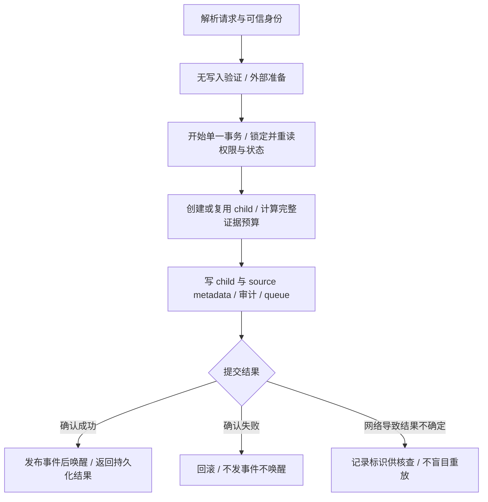

# 最近功能审核问题修复方案

> **For Claude:** REQUIRED SUB-SKILL: Use superpowers:executing-plans to implement this plan task-by-task.

**Goal:** 修复已确认的 2 项 P1、5 项 P2，消除已定位的测试配置与同步错误，并用符合仓库规范的正式构建重新建立完整验收基线。

**Architecture:** 生命周期复用既有 issue/task 服务，将数据库写入与提交后通知分离，由一次 PostgreSQL 事务提交后续 issue、证据、审计和任务队列。技能展示复用现有登记与默认文案识别，Observer 保持原权限；E2E 使用隔离 API、正式 Web 构建和独立测试数据库。

**Tech Stack:** Go、pgx/sqlc/PostgreSQL、Next.js、React Query、Vitest、Playwright、Electron；不新增依赖。

---

> 实施更新：三个批次已经完成，完整检查及全部专用E2E通过。见[修复与验收报告](../reports/2026-09-24-qa-remediation-report.zh-CN.md)。下文保留最初方案的调查时点和选定合同。

## 1. 可修复性结论与本轮状态

**7 项已确认功能缺陷均有具体实现路径。** 最复杂的是生命周期的事务边界与并发控制，不能仅靠移动一个长度检查或增加一个 `WithTx` 完成。技能登记、指令冲突、认证测试前提、桌面旧文案与设置导航竞态都有明确修改位置。

角色模板创建和 onboarding 超时尚不能认定为产品缺陷。先在正式 Web 构建下原样复验；若仍失败，再根据新的 trace 定位实际导航、查询或渲染问题，不预先改产品逻辑或放宽时间限制。

本方案基于 `a806e8c4232513ee49bf2dad92fb5dd0f5971778`。本轮只读核查、撰写方案；尚未实施以下代码修改，也没有新的修复后测试结果。原始证据见 [审核报告](../../.gstack/qa-reports/2026-09-24/review-summary.md)，专题设计见 [生命周期方案](../../.gstack/qa-reports/2026-09-24/plan-lifecycle.md) 和 [技能/角色方案](../../.gstack/qa-reports/2026-09-24/plan-catalog.md)。这些 `.gstack` 链接是本机保留的审计工件，不随 Git 分发；实施所需合同和验收条件已归纳在本文。

### 必须纠正的验证前提

`.trellis/spec/web/frontend/e2e-run-environment.md` 明确要求 `next build` + `next start`。上一轮使用 `next dev --webpack`，出现冷编译、开发浮标和内存重启，因此其 Web 结果是开发模式下的诊断证据，不能代替规定的正式构建验收。

进一步核查发现 `scripts/check.sh` 自身仍以 `pnpm dev:web` 启动 Web，并且仅凭端口返回 200 就复用已有服务。这与上述规范冲突，也可能复用错误提交。修复应落实到可重复的验证入口，不能继续依赖人工预热页面和临时修改 Next 配置。

## 2. 逐项处置表

| 编号 | 未通过项/缺陷 | 推荐修复 | 可行性与风险 |
| --- | --- | --- | --- |
| F1 / P1 | Agent 后续任务丢失人工来源 | 复用可信 acting-task 来源与 attribution classifier，保留 originator/accountable/delegated task | 可修；须验证私有 Agent 权限，不能把 runtime owner 当 originator |
| F2 / P1 | 返回 400 后仍创建并排队 | 写前完成可做的验证；所有必需写入与 queue INSERT 放同一事务 | 可修；涉及共享服务的副作用拆分，风险较高 |
| F3 / P2 | metadata 超限、latest/history 半写 | 整对象 8 KiB 预算、同一 UPDATE、源行并发保护、超限零写入 | 可修；有明确容量合同取舍，见第 4 节 |
| F4 / P2 | 新建 child 丢 `handoff_note` | 新建和复用统一使用带 note 的事务排队；Agent/squad 均返回真实 task ID | 可修；不覆盖已经运行/排队任务的备注 |
| F5 / P2 | `correctness=fail` 仍 pass | 定义 correctness 的有限判定映射，保留其他类别既有安全停止语义 | 可修；不能把所有 result 都改成只接受 pass |
| F6 / P2 | 两个技能误分类、翻译和搜索失效 | 补登记并同步 zh 默认描述，增加真实目录全覆盖校验 | 可修；重点保护用户定制和已有副本 |
| F7 / P2 | Observer 指令要求创建任务 | 改为当前评论给出建议，由有权限负责人创建；更新相应模板版本 | 可修；版本更新不自动修复存量副本 |
| T1 | 未登录应跳 login，但设备登录开启 | 主套件显式关闭设备认证；独立开启模式验证真实 device login/NoAccess | 可修；只改隔离测试配置，不改产品默认认证行为 |
| T2 | role 创建 5 秒 URL 超时 | 正式构建下原断言复跑，记录创建响应、导航与详情就绪 | 需复验；201 已有证据，不能据此推断完整导航已通过 |
| T3 | onboarding 提交/首次导航超时 | 同上；验证完成状态、Projects URL 和 Welcome dialog 全链路 | 需复验；不把 skip 路径通过替代完整回答路径 |
| T4 | 隐藏字段测试提前 reload/切 tab | 等待精确目标 URL、当前 tab 已激活后再操作；保留持久化断言 | 根因明确；控制副本曾被开发导航超时阻断，尚未证明修复通过 |
| T5 | 桌面 Help 旧中文断言 | `文档` → `使用文档`，`反馈` → `意见反馈` | 可修；只替换这两处期望的副本已验证通过 |
| T6 | TS/Go 首轮不稳定 | 分阶段限并发，Go DB 与常驻 API 分离；单列虚拟列表卸载后计时器风险 | 环境部分已证实；低并发通过不能证明所有异步竞态已消失 |

已通过的 Web/Electron 热发布、批量标签移除/部分失败重试/权限边界作为回归保留，不安排无依据的业务修改。

## 3. 推荐批次与依赖

| 批次 | 交付 | 完成门槛 |
| --- | --- | --- |
| A | 正式构建 E2E 入口、服务身份及测试隔离；生成修复前基线 | 能证明 API/Web 提交与模式，原失败可解释，旧服务不被误复用 |
| B | F1–F5 生命周期修复；F6/F7 可由独立负责人同时准备 | 授权、事务、故障注入、容量、并发和旧客户端兼容全部通过 |
| C | T1/T4/T5 确定测试修复，T2/T3 根据 A 的证据决定是否另修代码；全量验收 | 一次完整运行通过，加上所有专用夹具与专项缺陷回归 |

生命周期内部允许小提交，但来源/备注/提前检查的“止血”不能作为原子性修复的最终交付。共享 `issue.go`、`task.go`、`lifecycle_handoff.go` 由同一负责人串行集成，避免两条并行修改链互相破坏事务边界。目录和测试入口可并行；正式测试执行按资源与共享 feed 依赖串行。

## 4. 生命周期选定合同

### 原子写入与通知



- 有立即排队要求时，child、child 的 RCA/prevention metadata、source latest/history、审计 comment、queue row 同事务；不能先 commit 再首次 enqueue。
- 无 Agent/squad 分配、仅记录证据的请求可以成功且没有 queue ID。实际运行目标不可用、权限拒绝或必需 SQL 失败须明确报告，不冒充成功排队。
- commit 后广播/唤醒失败不撤销已持久化事实；返回成功并记录通知失败。实施时验证现有 polling 能发现队列及其恢复边界，不承诺尚未证明的恢复时延。
- 队列幂等须保留：按现有去重键及上下文确认可兼容复用的 pending 任务，不新增 queue、不覆盖 note/attribution、不重复发任务通知；成功返回 201 和实际 task ID。新备注、可信授权上下文或实际运行目标与旧任务不兼容时返回 409 并整笔回滚；权限拒绝仍返回授权错误。此处幂等针对 child/task 身份，本次 evidence/audit 仍按已有合同追加。
- PostgreSQL 唯一冲突后不能继续使用已 abort 的事务。采用已有约束兼容的 `ON CONFLICT` 或 savepoint 回滚后重读；具体方案以既有去重回归为约束。不能把所有重复请求统一改为 409，破坏已有 incident-learning 幂等要求。
- 行锁、workspace/owner fence、普通/SourceContext 创建的锁顺序需并发测试证明。优先不扩展到全库锁协议；局部冲突可整事务有界重试，但不能在不确定 commit 后重试。

### 容量合同：保持 8 KiB，不静默截断证据

权威限制是 `server/migrations/105_issue_metadata.up.sql` 的 `pg_column_size(metadata) <= 8192`，不是 Go JSON 长度 7000/28000。

推荐处理：锁定后读最新 metadata，合并用户其他 keys、latest 和追加后的 history；history 最多 20 条，整对象超限时只移除最旧历史。最少保留本次完整 evidence；仍放不下则 **400 + 整个 handoff 零写入**。不删除用户其他键，不截断本次正文，不提升数据库上限。用同一候选 JSONB 的 PostgreSQL 大小校验，并保留 CHECK 兜底；source/child 都受约束。

**原 4500 字符探针的 201 断言需要公开修正其假设。** 它假定“单条小于 7000 必可写”，但 latest/history 重复存储后与 8 KiB 总上限冲突。正式回归拆成“整体能容纳则 201 且完整写入”和“整体不能容纳则 400 且全量状态不变”；原失败证据保留。不能声称五个原探针不改断言就全部通过。

如果产品要求任意 7 KiB evidence 和 20 条历史都必须保存，需要独立历史存储/引用模型及兼容迁移；这是另一项存储设计，不纳入本次最小修复。

### 评测判定：保留已存在的安全停止语义

保持现有请求字段；对 correctness 的最小推荐映射为：

| correctness.result | gate 结果 |
| --- | --- |
| `pass`、`confirmed` | 本项满足；其他必需项也满足才整体 pass |
| `fail`、`hold` | hold |
| `unknown`、`suspected`、未识别值 | unknown |

缺版本、trace 或类别仍不得 pass；重复 correctness 中任一失败不能被后续 pass 覆盖。安全类别仍要求 blocked。已有 fixture 的 `tool-failure=unknown`、`cost/latency/drift=hold` 代表符合预期的安全停止，必须继续通过，不能做全类别 `result == pass` 判断。

未来把实际结果和独立 verdict 分离更清楚，但需要新增 API 合同和兼容矩阵，本次不扩大到该改造。

## 5. 可执行任务

### Task 1：修正验证入口并取得正式构建基线（A）

**文件：** `scripts/check.sh`、`scripts/dev-env.sh`、`scripts/dev-env.test.sh`、`Makefile`、`playwright.config.ts`；必要时新增 `scripts/check.test.sh`。更新 `.trellis/spec/web/frontend/e2e-run-environment.md` 的实际命令。

1. 为验证入口添加可控的进程/命令夹具，复现“复用未知服务、默认启动 dev”的错误。检查脚本失败必须非零退出，不得误报成功。
2. 复用 `dev-env.sh` 的服务归属与 PID/提交校验，扩展显式 production Web 模式，默认开发模式保持原用途。生产构建成功之后才启动 `next start`；登记 build ID、commit、mode、PID 和命令。`check.sh` 要求此模式，未知/不匹配监听者不被杀死或复用。
3. 构建时传入正确的 `NEXT_PUBLIC_API_URL` / WS 配置；运行时设置 `REMOTE_API_URL`。正式 Web 构建不等于生产 API 部署，API 继续使用隔离数据库、测试验证码/邮件配置。
4. Go handler 测试数据库与 E2E API 数据库分开、均完成迁移；不能只限制并发却继续共享被常驻服务清扫的 runtime 表。启用 Redis 时测试 auth 限额单独配置，Redis 集成测试另用独立实例。
5. 先仅运行原 4 项 Web 失败及桌面设置，保存修复前正式构建结果。T2/T3 此时不改断言、重试次数或超时。失败截图先保存，再做 fixture teardown，避免删除工作区后的页面误导诊断。

核心 Web 命令（在已加载任务专用 API/端口配置的 checkout 执行）：

```bash
pnpm --filter @multica/web build
pnpm --filter @multica/web exec next start --port "$FRONTEND_PORT"
# 服务就绪且身份校验通过后，在另一个受控进程执行：
pnpm exec playwright test e2e/auth.spec.ts e2e/agent-role-template.spec.ts e2e/onboarding-smoke.spec.ts e2e/settings-preferences.spec.ts --workers=1 --retries=0
```

**验收：** 不出现 `next dev`/冷编译/HMR；报告含 API/Web provenance；启动失败不会运行测试；结束只停止本任务进程。该任务不需要通过修改全局 Next heap、关闭浮标或放大等待值来取得绿灯。

### Task 2：先建立生命周期正式回归（B，先红）

**文件：** `server/internal/handler/lifecycle_handoff_runtime_test.go`、`server/internal/handler/lifecycle_handoff_authorization_test.go`、`server/internal/service/lifecycle_handoff_test.go`；事务服务测试放对应 service 包。复用审计目录保存的 `lifecycle_review_probe_test.go.txt`，不照搬其错误容量假设。

1. 以 `dbfx` / `testutil.Call` 建立来源、超长拒绝无副作用、备注、metadata 全有全无回归；纯评测矩阵放 service 层。
2. 保存请求前后 source/child metadata、child 数、comment 数、queue、counter 和事件/唤醒观测。注入 metadata、comment、queue 失败，断言不留半成品。
3. 增加 Agent 与 squad、新建与复用、跨 workspace/伪造来源、私有 target、严格归因、重复请求的矩阵。两次兼容请求均须 201、同 child/task ID、仅一条 queue；新 note/来源/运行上下文不兼容则 409 且旧数据不变。现有幂等测试未分配 Agent，不能代替队列去重测试。
4. 在独立 PostgreSQL 跑目标回归，确认旧代码失败原因与审计一致，再进入实现。

```bash
# cwd: server；DATABASE_URL 指向专用、已迁移且无常驻 API 的测试库
bash ../scripts/go-test-with-agent-cli-guard.sh -- go test ./internal/handler -run 'Test.*Lifecycle' -count=1
bash ../scripts/go-test-with-agent-cli-guard.sh -- go test ./internal/service -run 'Test.*(Lifecycle|AgentEvaluation)' -count=1
```

### Task 3：实现生命周期事务与来源/备注修复（B）

**文件：** `server/internal/service/issue.go`、`server/internal/service/task.go`、`server/internal/handler/lifecycle_handoff.go`、`server/internal/handler/issue.go`；必要的授权 helper 在 `server/internal/handler/agent_access.go`；metadata SQL 在 `server/pkg/db/queries/issue.sql`，如需调整队列冲突查询则修改 `server/pkg/db/queries/agent.sql`，并重新生成相应 sqlc 文件。

1. 抽取 `IssueService.Create` 的数据库阶段，原 Create 保留 wrapper 行为。拟新增的 InTx 入口不 Begin/Commit、不广播、不自动排队。保留计数器、position、duplicate 和权限检查；不复制第二份创建流程。
2. 参照已存在的 `PrepareChatTaskEnqueue`、`EnqueuePreparedChannelChatTaskInTx`、`FinalizeChatTaskEnqueue` 拆 issue/squad 排队。它们是结构先例，不把 lifecycle 假装成 chat。外部 overlay 准备在锁前，事务内重验实际 target 与授权状态。
3. handler 统一编排单事务，source metadata 一次更新；审计失败返回错误；所有查询使用同一 qtx。不存在 TxStarter 时在写前拒绝，不能退回非事务路径。
4. 普通 CreateIssue 和 lifecycle 复用可信来源逻辑；不得从请求 body、旧 child creator 或 runtime owner 伪造人工来源。新建/复用排队都显式传 note；squad 返回真实 task ID，不能返回占位字符串 `queued`。
5. 按第 4 节实现预算、幂等、权限重验和提交后通知。SQL 修改后 `make sqlc`，不手改生成文件、不新增 FK/迁移来绕过容量问题。
6. 运行 Task 2，并增加可控并发 barrier：同时 handoff、普通 metadata 更新、同名 child 创建、删除/SourceContext 路径。检查无历史覆盖、重复任务、死锁和提前事件。

**验收：** F1–F4 消除；已确认失败的事务无业务写入和通知；成功返回的 queue ID 对应数据库真实记录。锁策略未经并发验证不得声明完成。

### Task 4：修正评测门禁（B）

**文件：** `server/internal/service/lifecycle_handoff.go` 与相邻 test/fixture；`server/internal/handler/lifecycle_handoff_runtime_test.go` 保留一次 HTTP 接线回归。

1. 先添加 correctness fail/unknown/任意字符串/混合重复项测试，保留现有六分类安全停止 fixture。
2. 实现第 4 节映射与聚合优先级，结构缺失和 safety 约束继续 fail closed。
3. 验证错误答案不再生成 pass，既有 `confirmed` 与合法负面场景仍有效。同步具体行为涉及的内置 skill/source-map。

### Task 5：修复目录与默认描述（B，可与后端并行）

**产品文件：** `packages/views/skills/lib/skill-presentation.ts`、`packages/views/locales/zh-Hans/skills.json`。

**测试文件：** `packages/views/skills/lib/skill-presentation.test.ts`、`packages/views/skills/components/template-skill-create-panel.test.tsx`、`packages/views/locales/parity.test.ts`、`e2e/skill-template-creation.spec.ts`、`e2e/localized-template-defaults.spec.ts`。

1. 前端完整性测试从服务端嵌入 SKILL.md 目录发现全部条目，不再用另一份相同的手写 13 项列表证明完整性；node 测试复用 frontmatter parser。
2. 登记 `multica-experience-validation` / `multica-migration-review`；zh 默认 description 与服务器 frontmatter 对齐。en/ja/ko 键已存在。
3. 继续用全文匹配识别默认描述；保留已有历史 alias。未发现这两项错误 locale 文本曾作为官方默认落库的证据，因此不凭空添加新的兼容别名。
4. 保护无 provenance 同名记录、改名、追加自定义文本、已编辑副本；语言切换和搜索不回写 description/config/files。
5. 正式构建下验证仅内置目录为 **15 官方、0 部署提供**；挂载模板仍单独分类。两项真实物化技能能翻译、双语用途搜索、打开已有实例。

```bash
pnpm --filter @multica/views exec vitest run skills/lib/skill-presentation.test.ts skills/components/template-skill-create-panel.test.tsx locales/parity.test.ts --maxWorkers=2
```

### Task 6：修复 Observer 交付指令（B）

**文件：** `server/internal/service/builtin_agent_templates/migration-reviewer/INSTRUCTIONS.md`、`server/internal/service/builtin_agent_templates_roster.go`、`server/internal/service/builtin_role_skills/multica-architecture-decision-record/SKILL.md`、`server/internal/service/builtin_role_skills.go`。

**测试/文档：** `server/internal/service/builtin_agent_templates_test.go`、`server/internal/handler/agent_template_test.go`、`server/internal/service/builtin_skills/multica-creating-agents/SKILL.md` 与其 `references/creating-agents-source-map.md`；相关 Trellis 规范。

1. 将直接创建补证/修复任务改为：在当前评论列明缺口、建议任务、负责人、验收条件，交有权限负责人创建。保留 hold/unknown、Observer 和 API 403 门槛。
2. Migration Reviewer 角色 v1→v2，ADR 技能 v5→v6。Architect 自身指令未变，角色 v2 不变；Migration Review 技能未改则 v1 不变。
3. 针对两份实际文本分别断言完整替代交付动作，配合现有 Observer API 拒绝测试；避免只搜一个禁词作为“已修复”。
4. 验证新实例采用新内容、已有副本 ID/内容/文件/绑定不变。版本号不会覆盖存量；旧冲突副本须另行显式维护，不能自动重写用户定制。

### Task 7：修复确定的测试合同与同步（C）

**文件：** `e2e/auth.spec.ts`、`e2e/settings-preferences.spec.ts`、`e2e/desktop-settings.spec.ts`、必要的 `e2e/helpers.ts`/测试环境入口。

1. 主套件 API 显式 `MULTICA_DEVICE_AUTH_ENABLED=false`，保持未登录 `/login` 的原断言；另设真实 API 开启模式，验证 `/auth/device` 和无 workspace 权限时 NoAccess，不能把正确 NoAccess 改成登录失败。固定两种配置并记录，不靠一条测试内模拟 capability 代替后端模式覆盖。
2. 设置测试每次点击 Issues 后等待精确 `/${slug}/issues` 再 reload；进入 Settings 等待无 query 的目标地址和 Profile 激活，再切 Preferences，等 `?tab=preferences` 和选中态。
3. 保留所有偏好刷新持久化、overflow menu、创建请求、后端 GET 和 issue detail 断言。导航同步示意：

```ts
await page.getByRole("link", { name: "Issues", exact: true }).click();
await expect(page).toHaveURL(`/${slug}/issues`);
await page.reload();

await page.getByRole("link", { name: "Settings", exact: true }).click();
await expect(page).toHaveURL(`/${slug}/settings`);
await expect(page.getByRole("tab", { name: "Profile", exact: true }))
  .toHaveAttribute("aria-selected", "true");
await page.getByRole("tab", { name: "Preferences", exact: true }).click();
await expect(page).toHaveURL(`/${slug}/settings?tab=preferences`);
await expect(page.getByRole("tab", { name: "Preferences", exact: true }))
  .toHaveAttribute("aria-selected", "true");
```

4. 桌面断言只更新“使用文档”“意见反馈”，保留方向键焦点顺序、Updates、中文 daemon 停止态和 native side-effect 隔离。
5. T2/T3 先用 A 的正式构建证据判断：若原用例通过，不改业务和时间阈值；若仍失败，跟踪提交 response、完成状态、React Query、router navigation 和详情就绪，补命名回归后做最小修复。

### Task 8：单测稳定性与最终验收（C）

**优先执行配置，按复现决定代码：** `scripts/check.sh`、`scripts/test-go.sh`；条件性涉及 `packages/views/issues/components/data-table-resize.test.tsx`、`packages/views/test/setup.ts` 和 `packages/ui/components/ui/data-table.tsx`。

1. TS、Go、Web build、浏览器分阶段执行；Vitest 在本机以有限 workers 跑整套。复用 `scripts/go-test-with-agent-cli-guard.sh`，默认测试不调用已安装 Agent CLI。
2. 对 `window is not defined` 单列命名回归：原栈指向 virtual-core debounce 在 jsdom 销毁后 notify。检查 unmount、observer/scroll timer 清理；确认是测试未完成交互还是组件真实泄漏后修对应层，不能用全局忽略异常/清空所有 timers 伪造通过。
3. Go webhook 测试用无常驻 API 的专用库。Agent fake-process 测试保持限并发，原 thread timeout/retry cleanup/final-output 用例须在完整包中通过；单次目标重跑成功不能替代完整包验收。
4. 全量 typecheck、lint、TS、Go race、vet、UI exports；对改过的脚本执行项目已有脚本回归。使用 CI 对齐的 Node 22 / Go 1.26 验证，记录本地差异。
5. 正式 Web 主套件一次完整运行，保留零重试基线；两个真实认证模式分开验收。专用 Electron/热发布夹具显式启用，发布测试不共享同时写入的 feed。
6. 新增专项回归另列，不继续固定总数为 97。失败场景的“测试通过”是正确验证 400/403/hold/回滚等合同，不是要求所有请求成功。

最终命令入口（各阶段加载各自隔离环境，顺序执行；Go 库须已完成迁移且没有常驻 API）：

```bash
pnpm exec turbo run lint --filter='!@multica/mobile' --force
pnpm exec turbo run typecheck --filter='!@multica/mobile' --force
pnpm exec turbo run test --filter='!@multica/mobile' --concurrency=1 --force -- --maxWorkers=2
bash scripts/test-go.test.sh
bash scripts/dev-env.test.sh
bash scripts/test-go.sh --race
(cd server && go vet -p 2 ./...)
pnpm check:ui-exports
pnpm exec playwright test --workers=1 --retries=0
git diff --check
```

已用 Turbo dry-run 核对：上述 test 命令将 `--maxWorkers=2` 传给 core、views、web、desktop、docs 的 `vitest run`，包任务串行执行；没有 test 脚本的包不执行，mobile 按根脚本既有范围排除。dry-run 只验证调度与参数，不代表测试通过。仓库没有 `make test-race`；`make test` 已调用 `scripts/test-go.sh --race`，此处直接使用该脚本以便隔离已迁移的 Go 测试库。专用桌面/发布环境的变量和启动命令复用当前 E2E 文件的夹具要求，并加入正式入口文档。

## 6. 最终验收条件与回滚

- F1–F7 的确定缺陷各有正式回归；事务任一必需写失败、权限拒绝、超限均无残余业务写入/提前通知。
- 原 E2E 剩余失败在正式构建下已解决或有独立未解决报告；必须得到一次完整通过，不能把多轮不同用例通过的并集称作全绿。
- 所有必要夹具确实运行；部署/热发布/桌面跳过原因逐项可追溯。保留 trace、前后 DB 断言、截图、启动命令、commit/build ID、首次失败和最终结果。
- 没有屏蔽测试、全局加 retry、扩大所有 timeout、放宽权限或覆盖定制副本。真实模型/真实安装器不由此测试自动获得验收。
- 无新增依赖、外键或 schema 扩容。共用服务重构仅为实现已要求的事务边界，保持普通创建调用方行为。
- 回滚以批次/原子提交组为单位，issue 与 queue 的事务接口和调用方一起回滚；模板正文与版本一起回滚。无数据迁移不代表降级安全：回到旧版本会重新暴露 P1，出现故障优先修正或暂停受影响入口，不能将恢复旧缺陷当作验收通过。
- 存量已被旧代码创建的孤儿 child、缺来源/备注任务，以及旧 Observer 副本需单独只读盘点。不得推测人工来源、改写正在运行的任务或自动删除历史记录；如需要修复数据，再形成具体清单和维护方案。

**建议：按 A → B → C 实施。** 后端原子性是主要工程风险；生产构建资源、锁顺序/并发去重、存量数据与旧副本范围是主要待验证项。方案已经可用于实施，但完成证据必须来自实施后的正式回归，不能提前承诺所有失败都会仅靠环境调整消失。
