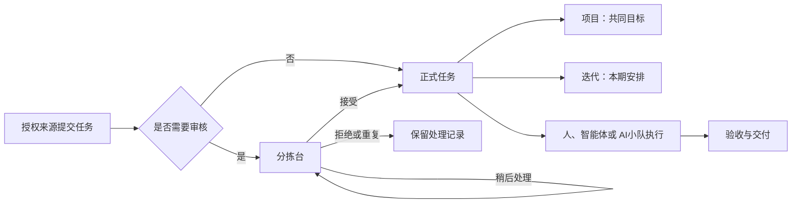

# 分拣台、迭代与专项需求总览

版本：v0.2 需求评审稿（已纳入 2026-10-04 评审结论）

日期：2026-10-04

产品：Multica

范围：产品需求与验收标准；不代表功能已经实现或实施方案已经批准。

实现跟进（2026-10-05）：**T1 人工分拣闭环已完成验收，并于北京时间 11:14 合入并推送远端 `main`**（`85b0d2e7e`），包括 CSV、Web／桌面端和服务端执行门槛。后续本地回归中，分拣相关 17 条用例均有通过证据；扩展测试及附带修复随后已提交本地主干（`bb581ef03`、`228abcc1e`）；T1 合并提交的远端 CI 未通过，生产发布未确认。技术设计见[实施计划](../2026-10-04-triage-t1-implementation.md)，回归、CI 与部署证据见[验收记录](../../../.trellis/tasks/10-04-triage-t1/verification.md)。P1 项目增强已建立父任务与五个子任务，进入[技术设计与开发拆分](../2026-10-05-projects-p1-implementation.md)；I1 迭代也已补齐[工程方案与六个子任务](../2026-10-05-iterations-i1-implementation.md)，通过 Architect→Critic 评审，保持 planning。P1 产品功能、I1 迭代及 T2／T3 自动化均未实现。

## 1. 文档导航

| 文档 | 回答的问题 | 定位 |
| --- | --- | --- |
| [分拣台需求](triage-prd.md) | 收到的工作是否应该进入正式流程，由谁接手？ | 新增准入队列 |
| [迭代需求](iterations-prd.md) | 本周期承诺哪些工作，结束后如何复盘和重新安排？ | 新增周期管理 |
| [专项需求](projects-prd.md) | 多项工作共同推进什么目标，哪里需要负责人介入？ | 增强现有项目 |
| [现状与参考依据](research.md) | 哪些已经存在，哪些来自参考文档，哪些是本次建议？ | 证据与范围边界 |

三份 PRD 可以分别评审，但第 3 至 8 节的共同规则必须保持一致。需求编号采用 `TRI-*`、`ITR-*`、`PRJ-*`；共同验收编号采用 `WM-AC-*`。

## 2. 背景与目标

Multica 已经支持人、智能体和 AI小队围绕任务执行工作，也具备项目、项目资源、项目上下文和多种任务视图。当前缺少独立的任务准入队列和周期承诺机制，项目层面则需要更直接地呈现目标、风险和推进情况。

本组需求建立三种互相配合的能力：

1. 分拣台处理输入质量：判断是否接下、是否重复、信息是否足够。
2. 迭代处理时间和范围：明确本期工作，记录增减，处理未完成工作。
3. 项目处理目标和协调：汇总交付情况、阻塞、延期与待验收工作。

不以增加管理层级为目标。个人或小团队可以只使用任务和项目，也可以独立启用分拣台或迭代。

## 3. 术语与实体边界

| 术语 | 本组需求中的含义 |
| --- | --- |
| 工作空间 | Multica 的成员、权限和数据隔离边界；沿用官方中文术语，不写成工作区 |
| 任务 | 用户提出的一件工作，对应 Issue；智能体的一次运行称为执行，与任务区分 |
| 分拣台 | 工作空间级准入审核队列，不等于个人收件箱 |
| 待分拣 | 尚未获准进入正式工作流的准入状态；不新增第八个任务执行状态类别 |
| 正式任务 | 无需审核的原有任务，或已被接受的待分拣任务 |
| 迭代 | 工作空间内有开始日和结束日的工作周期，与项目独立 |
| 专项／项目 | HiFox 的专项在 Multica 中映射为既有 Project；界面继续使用项目，不新增并列实体或导航 |
| 收件箱 | 个人或智能体接收通知的入口；通知已读、归档不会改变任务准入状态 |
| 项目负责人 | 成员或智能体，负责协调；不自动获得额外权限，也不等同于任务负责人或执行小队 |

一条任务最多属于一个项目和一个当前迭代归属；两者必须与任务位于同一工作空间。这里的当前归属表示最新安排，可以指向未开始或进行中的迭代，与"当前正在进行的迭代"不同。任务可以没有项目，也可以没有迭代。一个项目可以跨多个迭代持续推进，一个迭代可以包含多个项目的任务。历史迭代参与记录不计入当前归属数量。

## 4. 默认取舍与评审状态

下表是三份文档的统一基线。"已确认"表示 2026-10-04 评审已经拍板，见第 10 节；"建议"仍是成稿时采用的产品建议，评审可以调整，调整前以本表为准。

| 问题 | 当前基线 | 取舍理由 | 状态 |
| --- | --- | --- | --- |
| 直接照搬 HiFox，还是适配现有产品 | 复用项目与现有任务状态，新增准入维度和迭代 | 避免双项目体系、重复上下文和执行状态含义变化 | 建议 |
| 首期平台 | Web、桌面端完整交付；移动端完整编辑入口后续交付 | 首期服务器和移动端仍须遵守过滤、权限和执行门槛；旧客户端不支持时应明确限制功能 | 已确认 |
| 分拣入口 | 工作空间独立开关，默认关闭；T1 来源为成员在分拣台手动创建和 CSV 导入，不接入聊天连接器 | 当前没有在用的聊天渠道；导入承接外部积压的批量输入。开启不等于公开收件，不新增匿名提交或访客角色 | 已确认 |
| 谁能分拣 | 有任务操作权限的工作空间成员；责任人负责跟进但不独占操作权 | 沿用 owner、admin、member 角色，避免第一期增加角色体系 | 建议 |
| 谁能配置 | owner、admin 配置开关、默认规则、时区和自动化策略 | 普通 member 可按现有权限处理任务、维护项目和安排迭代 | 建议 |
| 接受是否立即执行 | 默认仅准入；接受并执行是显式的第二种操作 | 不能让选择项目、负责人或默认小队意外启动执行 | 已确认 |
| 待分拣与任务状态 | 准入结果独立于现有七类任务执行状态；待审核任务不能被启动 | 沿用既有状态类别和自定义状态解析，具体存储方案留给技术设计 | 建议 |
| 迭代初期模式 | 手动模式，同一工作空间最多一个进行中迭代 | 先形成可验证的周期闭环；自动节奏在后续阶段增加 | 单一进行中已确认；手动模式为建议 |
| 初期统计单位 | 任务数，项目和迭代分别明确统计口径 | 不把现有任意数字属性直接当估算点数，不把智能体数量当团队容量 | 已确认 |
| 项目进度口径 | 保留 `(done + cancelled) / 全部正式任务` 的范围闭合进度，新增完成数和取消数 | 已有项目的百分比含义不变，取消也不再冒充交付 | 已确认 |
| 性能目标与阈值 | 各 PRD 的数值是建议值，实施前测出基线再锁定 | 目前没有实测数据，提前定死会让验收依据失真 | 已确认 |
| 自动化程度 | 规则和 AI 建议逐步增加，初期由人确认关键写入 | 保留执行依据和复核能力 | 建议 |
| 跨工作空间专项 | 不纳入本组交付 | 工作空间是权限边界，不直接照搬组织内跨团队空间的语义 | 建议 |

替代方案包括一次性建设完整规则引擎、自动节奏和跨工作空间专项，或仅用标签与保存视图模拟这些能力。前者首期范围过大；后者不能提供统一准入、周期快照和结转语义，因此当前采用分期新增两个独立能力、增强既有项目的方式。

## 5. 跨模块业务规则

### 5.1 准入与执行

- 待分拣任务可以记录拟归属项目及候选负责人，但不能因此触发项目默认小队、任务指派唤醒、@提及执行、自动化或其他执行入口。
- 待分拣任务、分拣拒绝任务和分拣重复任务均不属于正式工作范围，不进入普通任务视图、迭代、项目常规进度或执行队列。分拣历史和显式包含分拣结果的检索仍可查看。
- 重新审核已拒绝或重复的任务，会回到待分拣；只有再次接受后才进入正式范围。重新审核和主动创建待分拣任务均要求分拣台已启用，关闭后分拣历史仅供查看。第一期不支持把已接受并进入执行的正式任务重新送回分拣台。
- 接受只解除准入门槛，保留明确的未启动状态。接受并执行须展示执行对象和上下文，并复用现有执行权限、可用性与确认行为。后续由用户显式发起的执行遵循现有规则。
- CSV 导入和后续接入的外部来源不能通过自带状态、迭代、负责人或项目字段绕过审核。来源身份和授权必须由服务端确认，不能仅依赖可编辑的文本字段或文件内容。
- 整个产品中的创建、编辑、批量操作、集成、CLI、API、智能体工具及移动端都遵守同一门槛；前端隐藏按钮不构成有效限制。

### 5.2 项目和迭代

- 接受时可同时选择项目和迭代。两者都完成校验后再提交，不能出现接受成功但字段静默丢失。
- 加入或移出迭代不改变项目、负责人和任务执行状态，不自动开始执行，也不终止正在运行的执行。
- 修改项目或项目状态不会自动更改任务状态、迭代归属或执行状态。
- 删除项目保留任务及迭代归属；结束、取消或禁用迭代保留任务及项目归属。
- 重复任务保留原任务和关联目标，不自动复制评论、附件、执行记录或继承迭代；第一期重复目标限制为同一工作空间内可见的正式任务。

### 5.3 统计口径

- 各模块以有稳定身份的任务为统计单位，重复事件和重复加入不得重复计数。父任务与子任务是独立任务，属于统计集合时各计一次；界面需要提示该口径，不能把任务数称为工作量或产能。
- 项目原有进度继续表示范围闭合比例：正式任务中 `(done + cancelled) / 全部正式任务`；新增的完成数量只计 `done`，取消数量单列。没有任务时显示暂无任务，不显示已完成 100%。
- 引入准入后，项目原有统计首次排除非正式任务，这是显式的范围规则变化；对未开启分拣台的既有项目，原有口径不变。被接受的任务在接受成功后才计入。
- 迭代完成率只将 `done` 计为交付完成，`cancelled` 不能冒充交付。具体范围增减、取消分母及原始承诺口径见迭代 PRD，并须同时展示取消和范围变化。
- 结束的迭代以结束快照为历史统计依据；之后任务改状态、换项目、移到下一个迭代，不重写该快照。历史记录更正只能通过显式、留痕的后续功能处理。
- 项目健康状况与项目状态、进度分别展示：进度达到 100% 不意味着自动通过验收，项目完成也不意味着自动批准外部发布。

## 6. 日期、并发与一致性

- 任务与项目的开始日期、截止日期保留现有纯日期语义，不因查看者所在时区移动一天。
- 新增统一的工作空间规划时区，供项目健康计算和新迭代的默认时区共用，由 owner、admin 维护。任一模块先交付时都可配置，不要求先启用另一模块。新设置默认建议创建者时区，没有可靠值时显式显示 UTC；尚未完成配置的项目健康计算明确按 UTC。
- 迭代日期按创建时从该设置明确保存的 IANA 时区解释。首期创建时必须展示该设置，不静默借用每位查看者的时区，也不为两个模块维护相互冲突的默认值。
- 迭代日期范围包含开始日和结束日，自动结束边界为结束日次日当地 00:00；跨夏令时仍按日历天计算。迭代保存创建时使用的时区，修改工作空间默认时区只影响以后新建的迭代。
- 分拣稍后处理保存具体时刻，按查看者时区显示并提供时区说明；到期恢复与工作空间迭代边界没有依赖。
- 相同请求重试不得重复准入、结转、创建执行或发送通知。冲突应返回最新状态和可恢复的操作入口，不覆盖他人刚完成的操作。
- 跨页面与多客户端看到的队列、计数和任务详情最终一致；失败时保留输入并说明哪些操作未完成。不得把缓存成功当作服务端成功。

## 7. 权限和通知共同原则

沿用 owner、admin、member 角色和现有任务、项目、智能体访问权限。项目负责人、分拣责任人、迭代协调人都是责任信息，不自动授予 owner 或 admin 权限；智能体也不能因为被指定为负责人而提升权限。

T1 不接入外部连接器；外部积压的工作由有任务权限的成员通过 CSV 导入带入分拣台。后续接入连接器须单独授权，并逐一通过防绕过验收。本需求不开放其他工作空间读取、匿名表单或未经授权的访客账户。通知只能发送给当前有访问权限的工作空间内接收者。若接入外部回执，需要单独配置，第一期不自动向外部聊天或邮件发送内容。

通知与实体状态独立：已读、归档或对通知执行稍后处理，都不代表接受任务、结束迭代或确认项目验收。责任人离开、智能体不可用或资源被移除时保留业务数据，并显示需要重新指定的状态。

## 8. 分期与依赖

| 阶段 | 可独立交付的范围 | 依赖 |
| --- | --- | --- |
| T1 | 分拣台人工闭环、准入门槛、CSV 导入、责任通知、审计 | 现有任务、成员、收件箱与执行能力 |
| P1 | 项目目标模板、健康概览、统计拆分、手动进展记录 | 现有项目；若 T1 已启用，遵守正式任务范围 |
| I1 | 手动迭代、单个进行中周期、任务归属、范围变化、结束快照和结转 | 现有任务；与分拣准入契约对齐，不强依赖开启分拣 |
| T2 | 可解释的条件规则、规则试运行、AI 分拣建议 | T1；AI 建议采用人工确认 |
| I2 | 自动节奏、冷却期、自动结转、时间窗口自动加入 | I1 的状态、快照和结转已验证 |
| P2 | 项目组合时间线、项目智能体进展草稿、可选里程碑 | P1；复用现有项目资源、执行和自动化体系 |
| T3 / I3 / P3 | 受约束的自动分拣、估算与容量、进阶自动跟进 | 分别见各 PRD；不作为首期验收条件 |

移动端编辑体验按模块跟进。任何模块上线前，旧客户端兼容性与服务端门槛必须先通过验收；不能以移动端 UI 尚未开发为由允许旧客户端绕过审核。

本组文档不承诺交付日期或人日估算。工程排期前仍需技术设计、迁移与回退方案、能力检测方案和测试计划评审。

## 9. 跨模块验收场景

| 编号 | 场景 | 验收结果 |
| --- | --- | --- |
| WM-AC-01 | 成员通过 CSV 导入待分拣任务，行内带项目、负责人、`in_progress` 状态和迭代 | 任务仍待分拣；项目和负责人作为候选保存，状态和迭代在导入结果中报告未采用；不进入迭代、不计项目常规进度、不启动智能体 |
| WM-AC-02 | 成员接受任务，同时设置项目和有效迭代 | 成功后成为正式任务，项目和迭代各计一次；普通接受不启动执行 |
| WM-AC-03 | 两位成员同时处理同一待分拣任务，一人接受，一人拒绝 | 只存在一个生效结果；后提交者获知冲突，不重复通知或启动执行 |
| WM-AC-04 | 已被接受的任务标记为 cancelled | 项目范围闭合进度和取消数按口径更新；迭代交付完成数不增加 |
| WM-AC-05 | 当前迭代结束，未完成任务结转下一期 | 项目归属及正在运行的执行不变；旧迭代快照保留，新迭代记录结转来源 |
| WM-AC-06 | 删除项目，任务仍在当前迭代 | 仅解除项目关联；任务、迭代归属和历史快照保留 |
| WM-AC-07 | 通过旧桌面端、移动端、CLI 或智能体工具尝试启动待分拣任务 | 服务端拒绝绕过，返回可理解的待审核原因；既有正式任务仍按原规则操作 |
| WM-AC-08 | 成员失去工作空间权限后打开通知、分拣项或历史迭代链接 | 不能读取目标内容、计数或附件；保留无敏感内容的失效提示 |
| WM-AC-09 | 项目所有任务都结束，但验收标准尚未确认 | 项目状态不自动变 completed；完成数量与取消数量可区分 |
| WM-AC-10 | 分拣台或迭代功能未启用 | 常规任务与项目流程保持可用；页面说明如何启用，不出现无效字段或静默写入 |
| WM-AC-11 | 结束迭代后任务被重开、删除或改项目 | 历史快照指标不变；打开实时任务时显示当前状态或已删除提示 |
| WM-AC-12 | 正常任务创建、CSV 导入与分拣接受重试，网络断开后恢复 | 不重复建任务、不重复接受、不重复结转、不重复创建执行 |

## 10. 评审结论

2026-10-04 评审确认以下五项，三份 PRD 已同步：

| 编号 | 问题 | 结论 | 落点 |
| --- | --- | --- | --- |
| 1 | 普通接受是否触发执行 | 普通接受只准入，不启动执行；另设显式的"接受并执行" | [分拣台](triage-prd.md) TRI-FR-08、TRI-FR-09 |
| 2 | 迭代首期范围 | 同一工作空间最多一个进行中迭代；按任务数统计，不做点数；Web、桌面端首期交付，移动端完整编辑后续交付 | [迭代](iterations-prd.md) §5、§17 |
| 3 | 项目进度口径 | 保留 `(done + cancelled) / 全部正式任务`，新增完成数和取消数 | [项目](projects-prd.md) PRJ-004 |
| 4 | 首批分拣来源 | T1 不接入聊天连接器；来源为成员在分拣台手动创建和 CSV 导入 | [分拣台](triage-prd.md) TRI-FR-02、TRI-FR-26 |
| 5 | 性能目标和阈值 | 各 PRD 的数值作为建议值，实施前测出基线再锁定 | 三份 PRD 的性能与指标章节 |

本轮未单独表态、沿用默认的是：内部自动化、智能体和 CLI 以成员权限创建的任务不进入分拣台（TRI-FR-02）。迭代 §17 和项目 §20 的细项仍在工程设计前确认。

## 11. 文档交付与验证

本轮仅交付需求文档，不修改产品代码，不发布外部工单，不开启运行环境或触发智能体执行。文档检查应覆盖：相互链接、需求编号唯一性、阶段引用、权限一致性、统计口径、状态转换与跨模块验收。
